## Thinking & Learning

:::: {layout-ncol=3}

::: {style="text-align:center;"}
[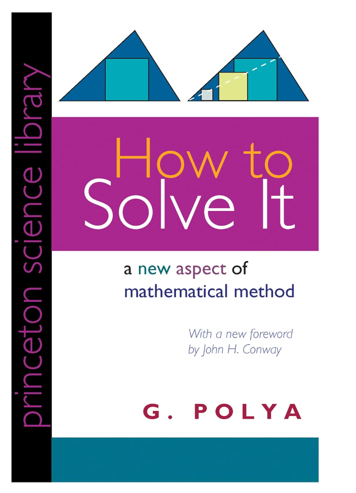{width="300" height="400"}](books-summaries/how-to-solve-it/)

[Read summary →](books-summaries/how-to-solve-it/)
:::

::: {style="text-align:center;"}
[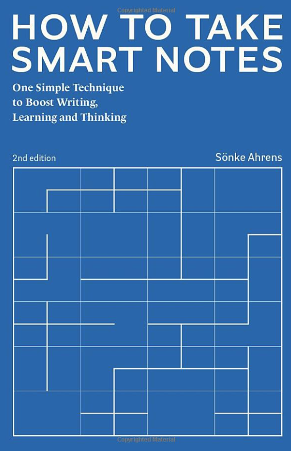{width="300" height="400"}](books-summaries/how-to-take-smart-notes/)

[Read summary →](books-summaries/how-to-take-smart-notes/)
:::

::: {style="text-align:center;"}
[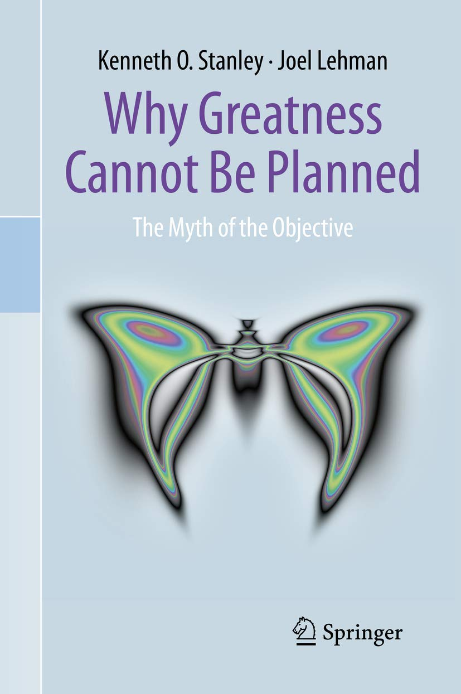{width="300" height="400"}](books-summaries/why-greatness-cant-be-planned/)

[Read summary →](books-summaries/why-greatness-cant-be-planned/)
:::

::: {style="text-align:center;"}
[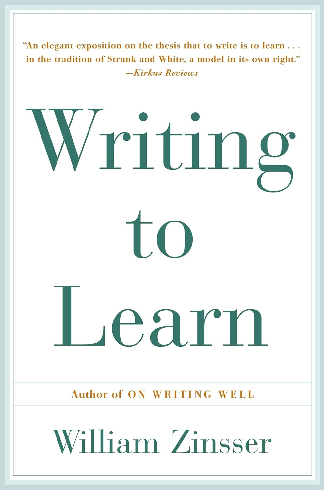{width="300" height="400"}](https://www.amazon.com/Writing-Learn-William-Zinsser/dp/0062720406/ref=tmm_pap_swatch_0?_encoding=UTF8&dib_tag=se&dib=eyJ2IjoiMSJ9.utJ69y5gHmEvzxiNMYhQxGcS5Lk7eZJ5USJtxKmRO8z2QiD7okBdbmJ9fkaM4AQEwV-U8qCq98iR5vw-3vPScZrJV4P4Le0TWmNpgZcbs7rqpmATFRn1Fv92JzueETCu8IHx9igKqmy_6NUtYya-q-od5zxp-wndayqgYNsqtJBment9nlzTHj-qPOcV8Crvz8v288UK4w75SC1QQMp2snq0YX5OZc24udlrLptkPd8.E9fPG2CQxYfrFB0m05IuhzzqJoUqCe9wmkjcfYqr2K8&qid=1769636430&sr=8-1)

:::

::: {style="text-align:center;"}
[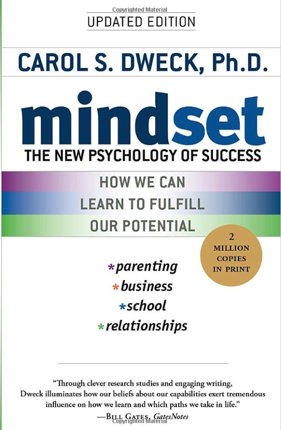{width="300" height="400"}](https://www.amazon.com/Mindset-Psychology-Carol-S-Dweck/dp/0345472322/ref=sr_1_6?keywords=growth+mindset&qid=1665531246&qu=eyJxc2MiOiI1LjY5IiwicXNhIjoiNS40MCIsInFzcCI6IjQuNDkifQ%3D%3D&sprefix=growth+min%2Caps%2C159&sr=8-6)

:::

::: {style="text-align:center;"}
[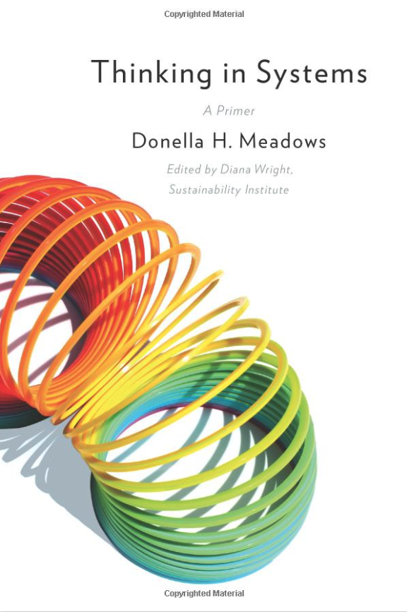{width="300" height="400"}](https://www.amazon.com/Thinking-Systems-Donella-H-Meadows/dp/1603580557/ref=sr_1_1?keywords=thinking+in+systems&qid=1665531744&qu=eyJxc2MiOiIxLjg0IiwicXNhIjoiMS40NCIsInFzcCI6IjEuNjgifQ%3D%3D&sr=8-1)

:::

::::

## Productivity & Focus

:::: {layout-ncol=3}

::: {style="text-align:center;"}
[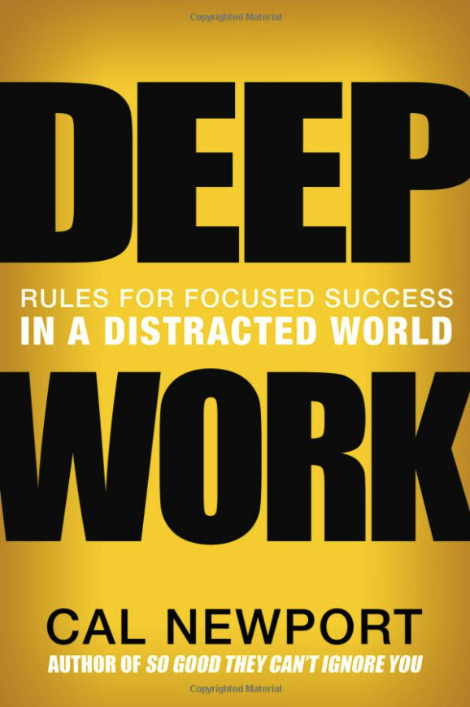{width="300" height="400"}](books-summaries/deep-work/)

[Read summary →](books-summaries/deep-work/)
:::

::: {style="text-align:center;"}
[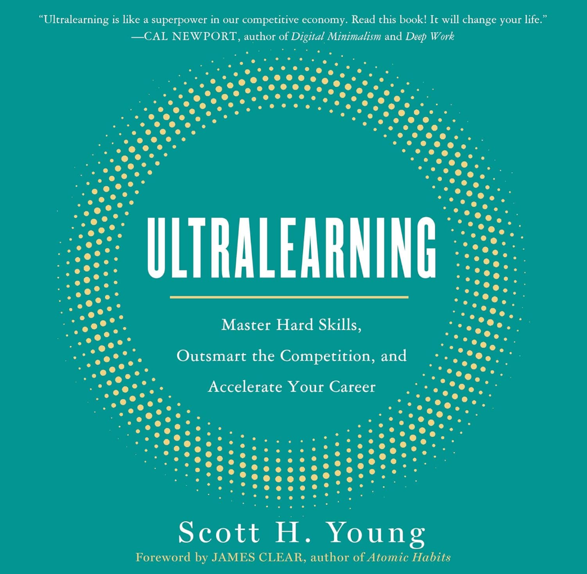{width="300" height="400"}](books-summaries/ultralearning/)

[Read summary →](books-summaries/ultralearning/)
:::

::: {style="text-align:center;"}
[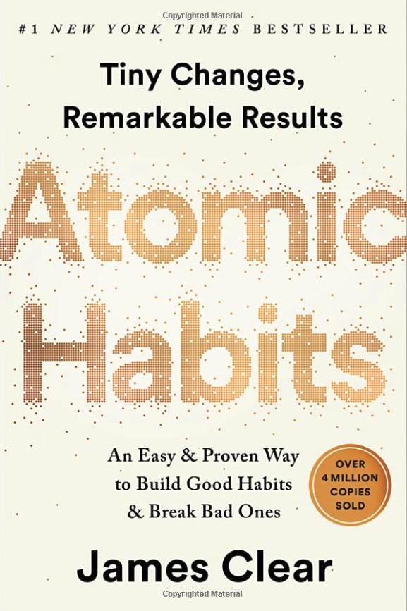{width="300" height="400"}](https://www.amazon.com/Atomic-Habits-Proven-Build-Break/dp/0735211299/ref=sr_1_1?keywords=atomic+habits&qid=1665530545&qu=eyJxc2MiOiIyLjU4IiwicXNhIjoiMi4zMCIsInFzcCI6IjIuMzYifQ%3D%3D&sr=8-1)

:::

::: {style="text-align:center;"}
[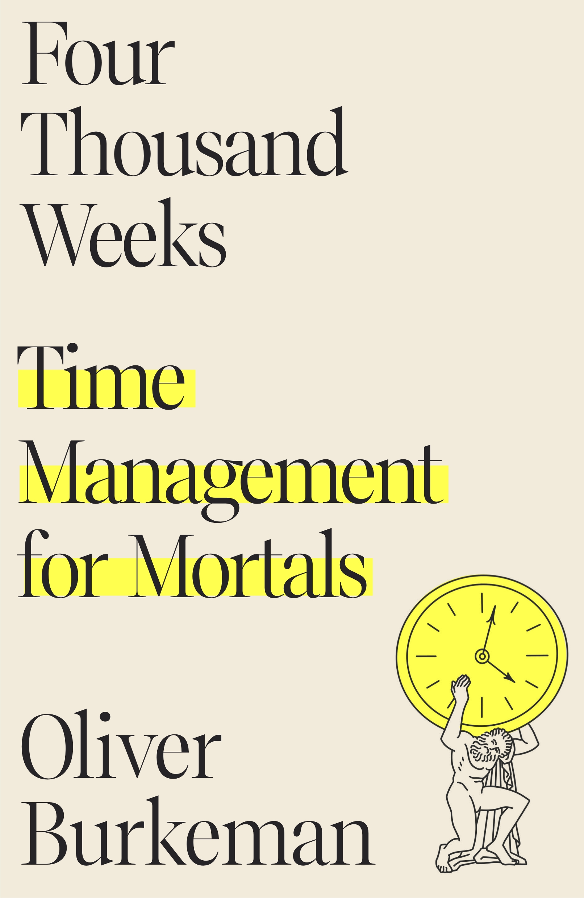{width="300" height="400"}](https://www.amazon.com/Four-Thousand-Weeks-Management-Mortals/dp/0374159122/ref=tmm_hrd_swatch_0?_encoding=UTF8&qid=1692026419&sr=8-1)

:::

::: {style="text-align:center;"}
[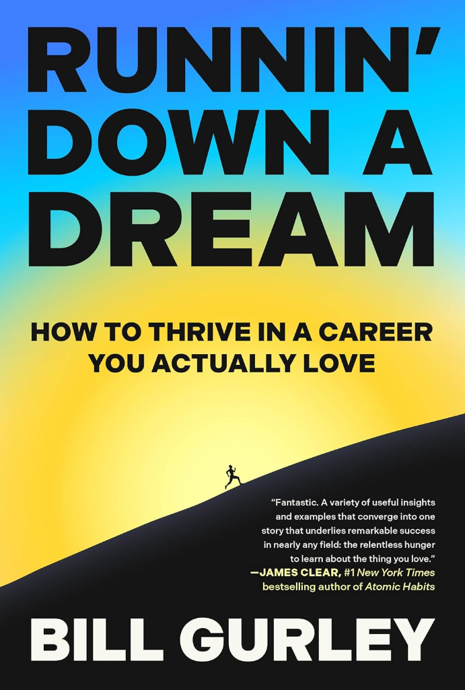{width="300" height="400"}](https://www.amazon.com/Runnin-Down-Dream-Thrive-Actually/dp/0593799666/ref=tmm_hrd_swatch_0?_encoding=UTF8&dib_tag=se&dib=eyJ2IjoiMSJ9.FjJwcSQXNcj6-ylqAsmQLcOa-bYg3H5gGP6cB92vkUNsh6VtAN6ACvDiaRvcw2qBUkKkR9Kft3Ii_BywiT3mw_yuEGcUNh3hIPjn2z29WdolgOwMJWXahzkp5Uzfxir9KfboQAP7LBYYkni5gqICZjeHgtWi1_5mfJHz_2CdQLq0w21giN_vx60w8LLC2C4c-n6zVZCvB_-Ka5o7udML9L6zbOsM2Jn2iSvJYDckSEc.wbAjUVz7Xt27GUdzw6rxDaAFS95GMaGbH-wxTd0Dit0&qid=1773433639&sr=8-1)

:::

::::

## Technology & Engineering

:::: {layout-ncol=3}

::: {style="text-align:center;"}
[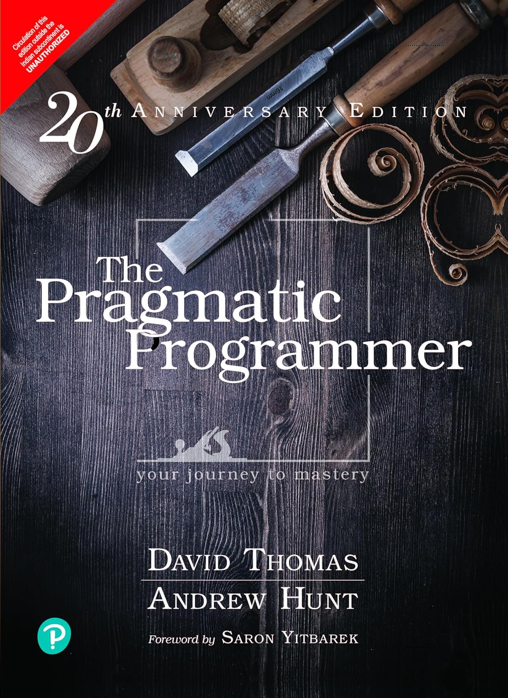{width="300" height="400"}](https://www.amazon.com/Pragmatic-Programmer-Anniversary-journey-mastery/dp/9353949432/ref=sr_1_2?crid=19O1Y5BYWBQ5D&dib=eyJ2IjoiMSJ9.kdai51KlSmR00Eeka59yexg0I6PKGBPl1h-BhlXuYSrGjHj071QN20LucGBJIEps.y9GdwNP_XJmm06zxXaZtvrTTDF_fUMhUEEoUtOpBz0Q&dib_tag=se&keywords=the+pragmatic+programmer+20th&qid=1769635419&sprefix=The+pragmati%2Caps%2C196&sr=8-2)

:::

::: {style="text-align:center;"}
[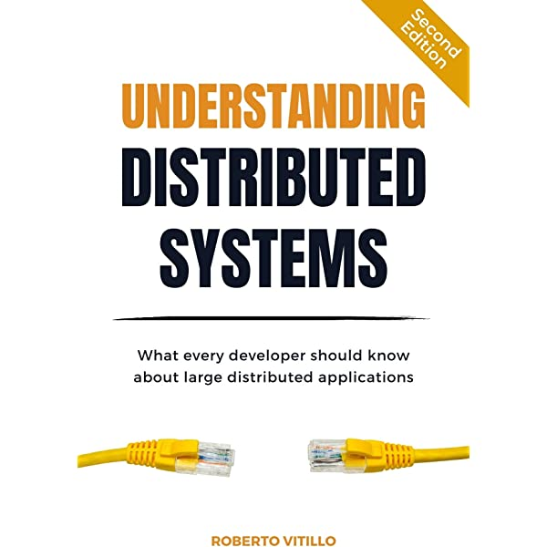{width="300" height="400"}](https://www.amazon.com/Understanding-Distributed-Systems-Second-applications-ebook/dp/B09YLRB7QV/ref=sr_1_1?crid=3FRAVHZ9910RZ&keywords=understanding-distributed-systems.&qid=1679185445&s=digital-text&sprefix=understanding-distributed-systems.j%2Cdigital-text%2C247&sr=1-1)

:::

::: {style="text-align:center;"}
[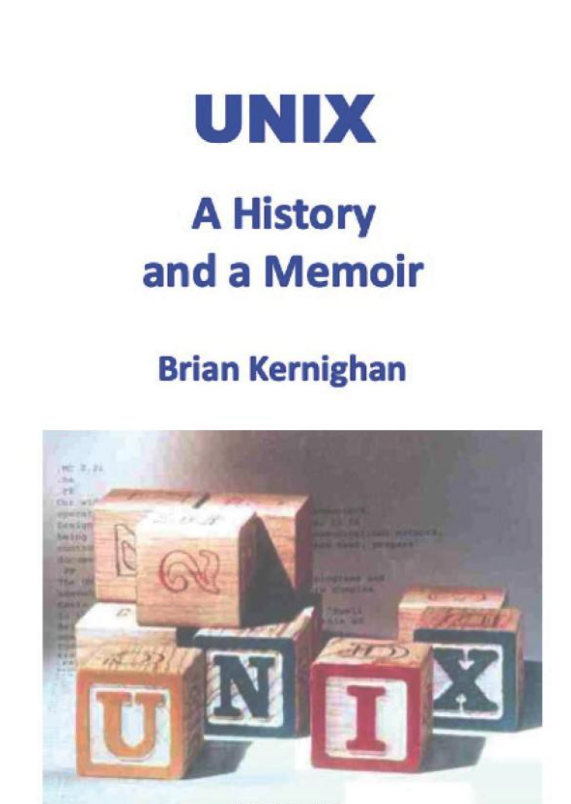{width="300" height="400"}](https://www.amazon.com/UNIX-History-Memoir-Brian-Kernighan/dp/1695978552/ref=sr_1_1?keywords=Unix+history+and+memoir&qid=1665532065&qu=eyJxc2MiOiIwLjY0IiwicXNhIjoiMC42MyIsInFzcCI6IjAuNjgifQ%3D%3D&sr=8-1)

:::

::::

## Grit & Perspective

:::: {layout-ncol=3}

::: {style="text-align:center;"}
[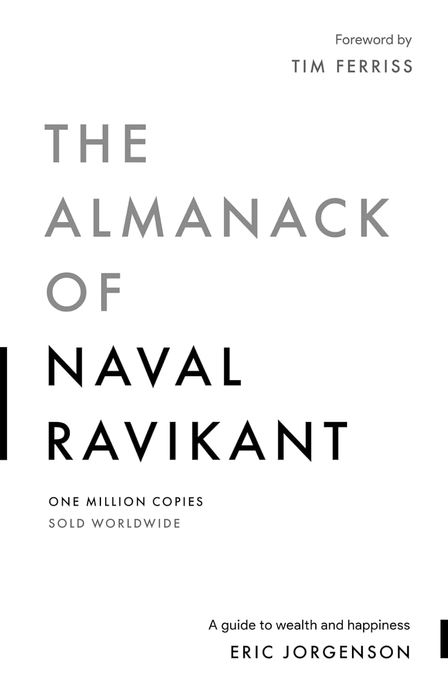{width="300" height="400"}](https://www.amazon.com/Almanack-Naval-Ravikant-Wealth-Happiness/dp/1544514212/ref=tmm_pap_swatch_0?_encoding=UTF8&dib_tag=se&dib=eyJ2IjoiMSJ9.Boypi4Aq2HqH8ZIXpUG6sScuLrsvG8QmiVxhWMtr8WPpriuasqN5ojKrksMElkUFhEN5fLVjmhHOSXpw-GRaLjHpRmSB-sSsutPr0Zb5bndcr4hn7zgy90IOcPx7AbF5KuM1XavfT1CKB1XDfeK2F_JZz36Ro3ztGJgZl9DsS9xC0SJ2RjwZ6VhovXeChxH1sRA0bzBnH9Hu91UEEe957COY_Vf0Hm9vOYMaFI46Wk8.Q5XhvA-WfNR52gI52ZbbnRtkZbdx65z8wsqFDDzZ8z8&qid=1773701008&sr=8-1)

:::

::: {style="text-align:center;"}
[{width="300" height="400"}](https://www.amazon.com/Grit-Passion-Perseverance-Angela-Duckworth/dp/1501111116/ref=tmm_pap_swatch_0?_encoding=UTF8&dib_tag=se&dib=eyJ2IjoiMSJ9.hEwWBqmUVOztzU3bYQICwfkLQzcM2cKwcn15Bebv4fB7uNxk5Tk8u79F4azxzQ1J1S5QaWSSFVHsJRYe6kk3yWKXY6qva14wqf4TD03mmDReUoqoreS7MQAstS5wo6iF804PCv00oPxKk-ehDeTZ8Dg_iF4VoZLb9HgIQ_l4I_HdwNxxmMB22oEXa_sYFpJsDMXimQJAJSIVQn4x9dQNEIzNEeqqAMBAJE7LIZRVaLc.iUdQyXPkPrXH0M-YGPpH7_V2Hc4Rvz8gRVKOEIQyUug&qid=1769635599&sr=8-1)

:::

::: {style="text-align:center;"}
[{width="300" height="400"}](https://www.amazon.com/Letters-Young-Scientist-Edward-Wilson/dp/0871403854/ref=tmm_pap_swatch_0?_encoding=UTF8&dib_tag=se&dib=eyJ2IjoiMSJ9.b9H7ZNczWlnH6kEpxUyDg5uMl9Ns_u0BAIlclJA_kn2792nuR9scXHkYY7SnhN7KB94CF9LFQccgcV5ZbPLX9SOMJAPdIjnugTvmHbmI9WoE8dmpKcSEVChFNxo0Qm3y_4Z4qD_j4rL8zvBxFMVWiBgNDcSlBtm1XsM4EE7JTAG8bluVAQEzlrAOygx16V4zjDCD5TnX5T9bAjsgYCBHj6k8sgtqYORaPwUL4UfK0K8.PWb3gsTFPd8UyJe7ea7k1Y6JusuESUMztzh6UuXzVM0&qid=1769636158&sr=8-1)

:::

::: {style="text-align:center;"}
[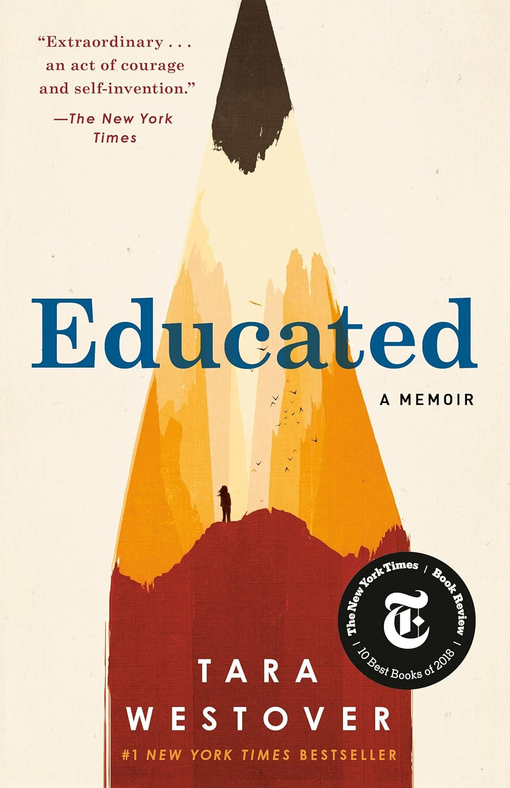{width="300" height="400"}](https://www.amazon.com/Educated-Memoir-Tara-Westover/dp/0399590528/ref=tmm_pap_swatch_0?_encoding=UTF8&dib_tag=se&dib=eyJ2IjoiMSJ9.-q1CggKmLQ0Ivl3LUCsVOdFz1-eN-NKmjykXQt9cmfI2vSOVWb63CTqcukJtLaP63A41E4xbX5DGG-YN_du1nvKz_F29vagdiWjvM7d4qipFXjEfEOE2a9pTRL5xETPQ8sHw3MeuiQzFJMmWtwTZP45TEvRM8HGKvsFDVaDjzJtKpQWRYnh3RIASbJh_oKGq-75ykQDVCZ64tcJa9IvIg4trcmyuoLHgAQ07FsGBQOw.n-hQkvsuI3fmVj3imWU7B2gzLGDiESSEASI4dghxWr0&qid=1769636276&sr=8-1)

:::

::: {style="text-align:center;"}
[{width="300" height="400"}](https://www.amazon.com/Elon-Musk-Walter-Isaacson/dp/1982181281/ref=tmm_hrd_swatch_0?_encoding=UTF8&qid=1700529651&sr=8-5)

:::

::::

## Economics & Society

:::: {layout-ncol=3}

::: {style="text-align:center;"}
[{width="300" height="400"}](https://www.amazon.com/Bitcoin-Standard-Decentralized-Alternative-Central/dp/1119473861/?_encoding=UTF8&pd_rd_w=x3iey&content-id=amzn1.sym.cf86ec3a-68a6-43e9-8115-04171136930a&pf_rd_p=cf86ec3a-68a6-43e9-8115-04171136930a&pf_rd_r=134-1752947-0416467&pd_rd_wg=tAfRh&pd_rd_r=fb47caf0-2ddc-4322-abdb-d67878d1a37b&ref_=aufs_ap_sc_dsk)

:::

::: {style="text-align:center;"}
[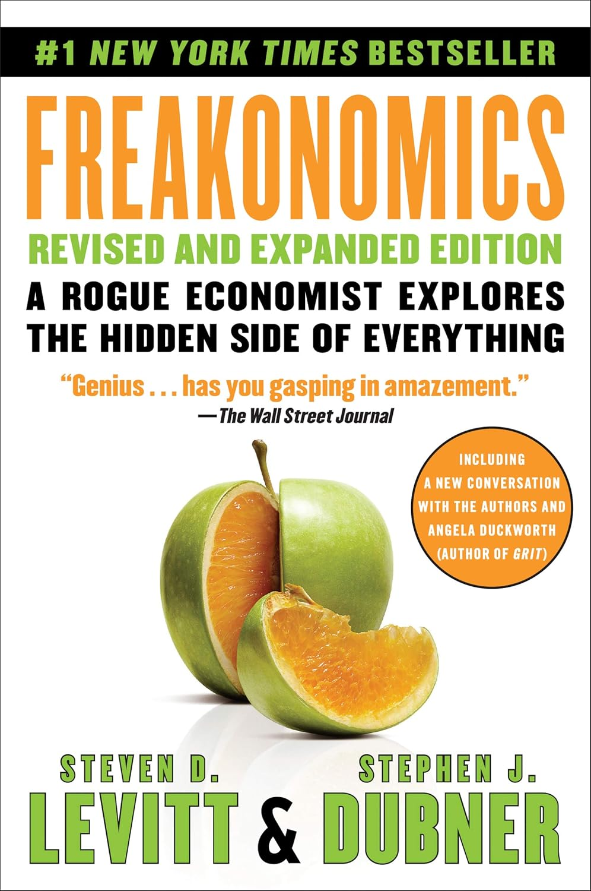{width="300" height="400"}](https://www.amazon.com/Freakonomics-Revised-Expanded-Economist-Everything/dp/0063032376/ref=tmm_pap_swatch_0?_encoding=UTF8&dib_tag=se&dib=eyJ2IjoiMSJ9.z-6J6ukuOfIBsxm2Zmx649tr_C8i6WmrCaQXrxi-u788NnWxeMoAEDvxkYr6Fd4pvWaQegcFgfbeYwdQehD7cDtO5tKKSSP3Vffar4ucCGA8CbJuFWOdRMPU5ccEzTDwWazikuUuWH3onZZICnOZbvVZSebjJeN0exsKBGMlOuZo7Oy3SleTqyfUuLDl30Gqg56a4eJKvOgO0vYKDYl8luF-sA8vRzb6afCeBhK7_6A.-ioLmfom3651xVHMcMyA0NS5SO5duoA-87Y09GRYmZk&qid=1769636551&sr=8-1)

:::

::: {style="text-align:center;"}
[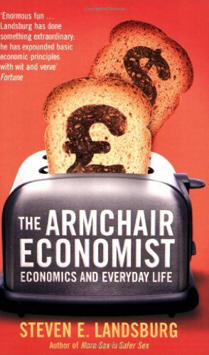{width="300" height="400"}](https://www.amazon.com/Armchair-Economist-Economics-Everyday-Life/dp/1451651732)

:::

::: {style="text-align:center;"}
[{width="300" height="400"}](https://www.amazon.com/Animal-Spirits-Psychology-Economy-Capitalism/dp/069114592X)

:::

::::
