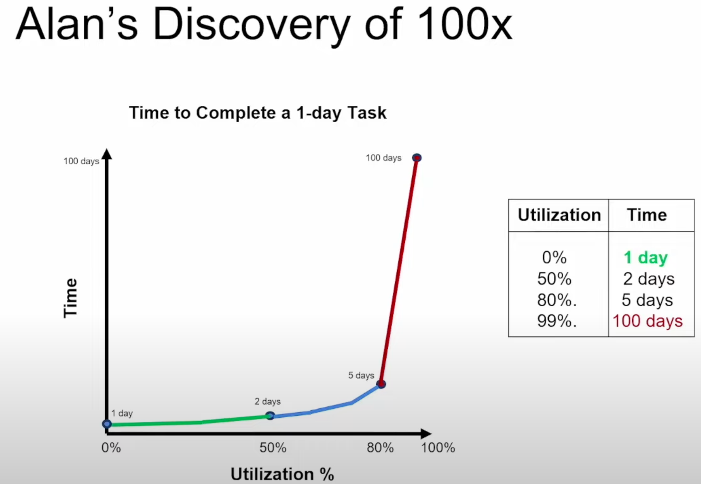
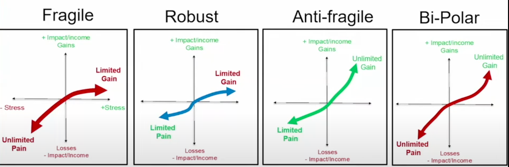

If there is a task that takes 1 day:

- If I am not utilized -> Only focus on this task -> 1
- If I am $50\%$ utilized -> Focus on the task half of the day -> 2 days
- If I am $80\%$ utilized -> Focus on the task $20\%$ of the day -> 5 days
- If I am $100\%$ utilized -> Focus on the task $1\%$ of the day -> 100 days

What would it take to achieve $100x$?

- Step 1: Get rid of all the other stuff and focus on 1 task
- You don't want _work_ to be waiting for _resources_. You want _resources_ to be waiting for _work_ (not too long)

How _Fragile_ am I:

Wealth paradigm:

- Wisdom > Health > Wealth
- God > Family > You
- Relationships > Experiences > Things
- Heart > Mind > Body
- Eternity > Temporary
- Exponential Opportunities
