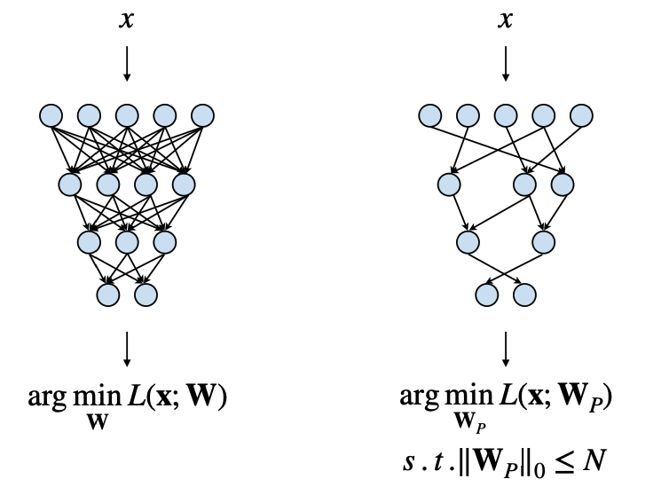
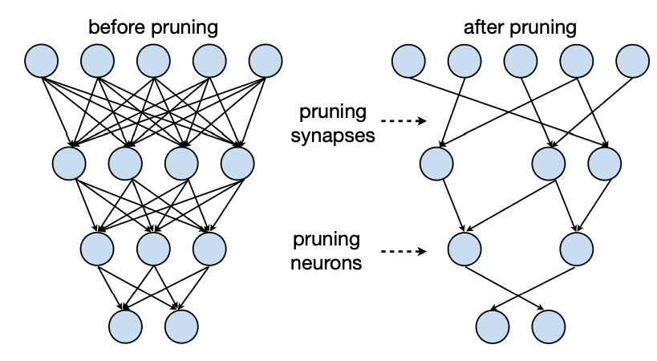

{height="500" width="800" fig-align="center"}

Neural network pruning is a critical optimization technique used to enhance the efficiency of deep learning models by systematically removing unnecessary parameters, such as weights or neurons, while maintaining model performance. This technique is particularly important because memory access and movement are extremely expensive operations in terms of both latency and energy consumption.

## Why Do We Need Pruning?

{height="500" width="800" fig-align="center"}

The primary objective of pruning can be formalized as minimizing a loss function
$L(W_P)$, where $W$ represents the original weights, $W_P$ is the pruned weights
subject to the constraint that the number of non-zero weights ($||W_P||_0$) is less than a threshold $N$.

$$\arg\min_{W_P} L(x, W_P)$$

subject to $$||W_p||_0 < N$$

This optimization leads to sparse weight matrices, which can significantly reduce:

- Model size
- Memory footprint
- Computational complexity
- Energy consumption

## Types of Pruning

{height="500" width="800" fig-align="center"}

1. **Weight Pruning**:

- Focuses on removing connections between neurons
- Reduces model size and computational complexity
- Based on weight importance metrics
- May require fine-tuning after pruning
- Results in sparse weight matrices [[1]](https://www.researchgate.net/publication/318471114_Activation_Pruning_of_Deep_Convolutional_Neural_Networks#:~:text=Activation%20Pruning%20of)

2. **Activation Pruning**:

- Removes entire neurons or channels
- Reduces computational cost more directly
- Based on activation importance
- Can lead to better performance in terms of misclassification error compared to unpruned networks [[1]](https://www.researchgate.net/publication/318471114_Activation_Pruning_of_Deep_Convolutional_Neural_Networks#:~:text=Activation%20Pruning%20of)

## Pruning Approaches

### 1. Only Pruning

- Simplest approach: directly remove weights without additional steps
- Often results in significant accuracy drop
- Not recommended for production systems

### 2. Pruning + Fine-tuning

- Prune weights followed by model fine-tuning
- Helps recover accuracy lost during pruning
- More effective than pruning alone [[2]](https://openreview.net/pdf?id=Cb54AMqHQFP#:~:text=In%20this%20paper%2C%20we,is%20fine%2Dtuning%2C%20which%20aims)

### 3. Iterative Pruning + Fine-tuning

- Gradually removes weights over multiple steps
- Each step is less aggressive than the previous
- Includes fine-tuning between pruning steps
- Achieves best accuracy with high pruning ratios (90%+ range)
- More computationally expensive but yields better results [[3]](https://arxiv.org/html/2409.19727v1#:~:text=allows%20the%20network%20to,a%20large%20portion%20of)

## Pruning Granularities

### 1. Fine-grained (Unstructured) Pruning

**Pros:**

- Maximum flexibility in weight selection
- Highest possible compression ratio
- Minimal accuracy loss [[4]](https://www.researchgate.net/publication/381997604_Research_on_pruning_optimization_techniques_for_neural_networks#:~:text=ratio.%20Fine%2Dgrained%20pruning%20has,because%20it%20is%20unstructured)

**Cons:**

- Irregular weight indices
- Difficult to accelerate on hardware
- Requires specialized implementations [[5]](https://www.researchgate.net/publication/381997604_Research_on_pruning_optimization_techniques_for_neural_networks#:~:text=the%20pruned%20model%20cannot,usually%20requires%20additional%20hardware)

### 2. Coarse-grained (Structured) Pruning

**Pros:**

- Hardware-friendly
- Easier to implement
- Maintains dense matrix operations

**Cons:**

- Less flexible than fine-grained pruning
- Limited to row/column pruning
- May result in lower compression ratios

### 3. Pattern-based Pruning (N:M Sparsity)

- For every M contiguous elements, N elements must be pruned
- Common pattern is 2:4 sparsity (50%)
- Uses compressed matrix format:
  - One matrix for non-zero values
  - One matrix for indices (bit)
- Some hardware architectures support this scheme natively

### 4. Channel-based Pruning

**Pros:**

- Most regular structure
- Highest potential speedup
- Straightforward implementation [[6]](https://www.sciencedirect.com/science/article/abs/pii/S0952197625009200)

**Cons:**

- Least flexible
- Lower compression ratio
- Can have uniform or varying sparsity across layers

## Pruning Criteria

### 1. Magnitude-based Pruning

- Removes weights with smallest magnitude
- Uses L1 or L2 norm for measurement
- Can be applied row-wise for improved regularity

### 2. Scaling-based Pruning

- Associates learnable scaling factors with output channels
- Prunes channels with small scaling factors
- More adaptive than simple magnitude-based methods [[7]](https://arxiv.org/pdf/1912.04845#:~:text=The%20strategy%20that%20has,results%20by%20pruning%20weights)

### 3. Percentage-of-Zero-Based Pruning

- Focuses on activation patterns
- Removes channels with highest percentage of zeros
- Requires analysis of activation patterns during inference
- Dynamic approach compared to static weight pruning

### 4. Regression-based Pruning

- Minimizes reconstruction error of layer outputs
- Avoids full backpropagation
- Particularly effective for Large Language Models
- More sophisticated approach with better accuracy retention

## Important Considerations

1. **Large vs. Small Models**: It's generally better to prune a large model than train a smaller model from scratch. Over-parameterization helps avoid local minima by providing more dimensions to escape saddle points.

2. **Hardware Considerations**: The choice of pruning granularity should consider the target hardware architecture. Structured pruning may be preferred for standard hardware, while specialized hardware might better handle unstructured pruning.

3. **Layer-wise Pruning**: Different layers may have different levels of redundancy, making uniform pruning across all layers suboptimal. Adaptive approaches that consider layer-specific characteristics often yield better results.

This comprehensive understanding of pruning techniques enables Machine Learning Engineers/Data Scientists to make informed decisions when optimizing their deep learning models for specific applications and hardware constraints.
