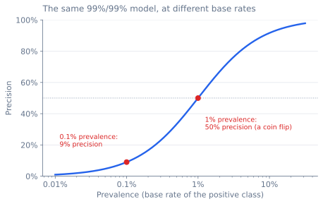
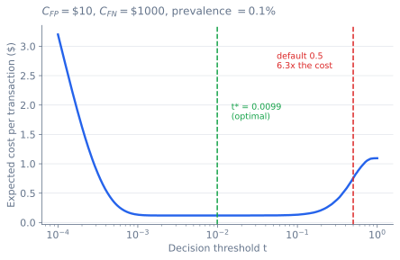

## Introduction

Fitting a model is the most commoditized skill in machine learning. Gradient boosting on tabular data, a fine-tuned transformer on text: these are an afternoon of work, and the libraries that do them are free, fast, and written by people better at it than you or me. The modelling half of this field has been solved so thoroughly that it is now the easy part.

Everything after `model.fit()` has not been solved, and that is where most ML projects fail.

The usual response is a checklist. Monitor your features. Version your data. Watch for drift. Every item is correct, but the list is unsatisfying, because it tells you *what* to do without telling you *why those things and not a hundred others*.

But production failures are not a grab bag. They have exactly one shape, and once you can write that shape down, the checklist stops being something you memorize and becomes something you derive. Three things that fall out of it:

- A backend service that is slow 1% of the time, called 100 times per user request, makes **63% of your requests slow**. Your p99 is a property of your architecture, not of any service in it ([the arithmetic is here](#sec-tail)).
- A fraud model with 99% sensitivity *and* 99% specificity, deployed at a 0.1% base rate, is **wrong nine times out of ten every time it fires**. Nothing is broken. That is arithmetic, and no amount of retraining changes it ([the arithmetic is here](#sec-base-rate)).
- Shipping the default 0.5 decision threshold is a silent assertion that a false alarm costs exactly as much as a missed fraud. In a simulation of two million transactions, that assertion costs **6.3x more per transaction** than the threshold the cost matrix implies ([the arithmetic is here](#sec-threshold)).

None of these is a modelling problem, and none is visible in a holdout metric. They are all versions of the same underlying failure.

This guide comes from two places: a decade of leading and designing ML systems across smart devices, healthcare, and enterprise AI, which is where the scars come from; and years of reading widely and working the ideas through from first principles until they were my own. What I have tried to add is the derivations. Where the standard advice hands you a rule of thumb, I show you where it comes from, because a rule you can derive is a rule you also know when to break. And where I expected one thing and the measurement said another, I say so.

The next section works out the frame. Every section after it is an attack on one of the three gaps that frame names. By the end you should be able to:

1. Derive a tail-latency budget from your architecture instead of guessing one
2. Compute the decision threshold your cost matrix implies, and explain why the default is wrong
3. Name which of the three mismatches any given production failure belongs to
4. Choose a retraining cadence from measurement rather than from habit

---

## The Three Mismatches {#sec-mismatches}

Training produces a function by fitting it to the data you have. Production runs that function on data you do not have yet, and the difference between those two distributions is where nearly everything goes wrong. That difference has a precise shape.

When you train, you choose $f$ to minimize an average loss over data you sampled:

$$\hat{f} = \arg\min_{f} \; \frac{1}{n}\sum_{i=1}^{n} L_{\text{train}}\big(f(x_i),\, y_i\big), \qquad (x_i, y_i) \sim D_{\text{train}}$$

When you deploy, you are scored on something else entirely:

$$\text{what you actually pay} \;=\; \mathbb{E}_{(x,y)\,\sim\, D_{\text{serve}}(t)}\Big[ L_{\text{business}}\big(f(x),\, y\big) \Big]$$

Compare the two expressions. An expected risk has exactly two arguments, **a distribution and a loss**, so only two things can differ between training and serving. The distribution can differ in two ways, either right now or later:

| | Mismatch | Formally | Where it bites |
|---|---|---|---|
| **1** | **Train $\neq$ Serve** | $D_{\text{train}} \neq D_{\text{serve}}$ | Leakage, training/serving skew, batch-vs-streaming features, sampling bias |
| **2** | **Metric $\neq$ Value** | $L_{\text{train}} \neq L_{\text{business}}$ | AUC that moves no revenue, accuracy under imbalance, symmetric loss under asymmetric cost, median latency under a tail SLO |
| **3** | **Past $\neq$ Present** | $D_{\text{serve}}(t)$ moves with $t$ | Drift, staleness, feedback loops |

That is the whole taxonomy, and it is exhaustive by construction: there is nothing else in the expression that can differ.

::: {.callout-note}
## Scope: supervised prediction, any model class
$f$ is any decision function. A hinge-loss SVM, a gradient-boosted ranker, and a logistic regression face the same three gaps, because the gaps are properties of **the data and the objective, not of the model class.** What varies is which repairs you get: the [threshold rule](#sec-threshold) needs a calibrated probability, while [importance reweighting](#sec-sampling) and the [drift analysis](#sec-drift) do not.

The real limit is that this is about **supervised prediction**, where a label eventually arrives and $L_{\text{business}}$ is a cost per decision. Reinforcement learning and unsupervised systems have their own failure taxonomies, and I will not pretend this one covers them.
:::

---

## What Production Demands {#sec-requirements}

### Why Tail Latency, Not Average Latency? {#sec-tail}

During training we optimize **throughput**: push millions of examples through, extract the most learning per unit of compute. We can afford to wait a day for a better model.

Serving inverts this priority. Now we optimize **latency**, and specifically not the average. The number that matters is the tail: p95, p99, sometimes p99.9.

It is tempting to read p99 as "1% of users have a bad time," which sounds survivable. It is not, and the reason is structural ([Dean and Barroso, 2013](https://research.google/pubs/the-tail-at-scale/)).

Suppose a single user request fans out to $N$ backend services (a feature service, a lookup, an embedding store, a model server) and each one independently has a 1% chance of being slow. The request is fast only if *every* service is fast:

$$P(\text{request is slow}) = 1 - (1 - 0.01)^{N}$$


| Fan-out $N$ | 1 | 10 | 20 | 50 | 100 | 200 |
|---|---|---|---|---|---|---|
| P(user request is slow) | 1.0% | 9.6% | 18.2% | 39.5% | **63.4%** | 86.6% |

::: {.callout-important}
## Your p99 is not a property of any service
At a fan-out of 100, a one-in-a-hundred event at the component level becomes a **majority event** at the user level. 63% of requests touch at least one slow service.

This is why a 10 ms operation can take 500 ms once it crosses twenty service boundaries: tail latency is a property of your *architecture*, not of any component in it. You cannot fix it by optimizing the slowest service. You fix it by reducing fan-out, hedging requests, or making each hop's p99 extremely good.
:::

The practical consequence is a trade-off people resist. An ensemble might buy 3% accuracy. If it pushes p99 past the budget, take the simpler model. Users rarely notice a slightly worse recommendation, but they always notice a slow page.

### ML Metrics Are Proxies {#sec-proxies}

ML metrics are not business value. They are correlated with it, sometimes, over some range. A recommender's NDCG is not revenue. A fraud model's precision is not dollars saved.

I learned this properly on a content recommendation system. We spent three months lifting the ranking model's AUC from 0.78 to 0.82, which is a real improvement by any offline standard. We deployed it and engagement did not move. The reason took another week to find: nearly all of the gain was in how we ranked items 50 through 100, and users almost never scrolled past item 20. We had spent a quarter optimizing a region of the ranking that no human being ever looked at.

AUC is not the villain. The problem is that an aggregate metric averages over regions of the input space that carry unequal business weight, and the model will happily buy its gains in the cheap ones. Before you optimize a metric, establish three things with whoever owns the P&L:

1. What user behavior actually drives value?
2. How does the model's output change that behavior?
3. What is the *sensitivity*: how much business metric per unit of ML metric?

Question 3 is the one that gets skipped, and it is the only one that tells you whether the project is worth doing. Sometimes the answer is that ML is a small term in a large equation. In a loan approval system, the model estimates creditworthiness, but the approval decision is dominated by regulatory floors, capital availability, and portfolio strategy. A better model may move nothing at all, and it is much cheaper to discover that in a spreadsheet than after two quarters of engineering.

### The Four Pillars {#sec-pillars}

Huyen's framing, and it holds up. Production systems need reliability, scalability, maintainability, and adaptability. Most of this is standard software engineering, so I will only dwell on the part that is ML-specific.

**Reliability** in ML means more than uptime, because ML systems fail *silently*. A web server that breaks returns a 500. A model whose feature pipeline breaks returns a confident, plausible, wrong number, and it keeps doing so for months. The defense is a **degradation ladder** that is decided in advance:

```
primary model  →  simpler/cached model  →  business rules  →  cached prediction  →  safe default
```

Every rung must be implemented and *tested*, and the bottom rung must be safe rather than merely available. A fraud system whose fallback is "approve everything" is not degrading gracefully; it is failing open, and that is expensive.

**Scalability** has three axes that interact: model complexity, request volume, and *number of models*. The third is the one that surprises teams. An architecture tuned for one large model often collapses under three hundred small ones, because per-model overhead (loading, memory, monitoring, versioning) was never on anyone's radar.

**Maintainability** is versioning, and in ML that means versioning code, data, models, configs, and feature definitions, because any one of them drifting silently produces a different system. Six months from now, nobody remembers why that threshold was 0.37.

**Adaptability** is the ability to change quickly, which requires modularity, monitoring that tells you *when* to change, and a safe rollout path ([testing in production](#sec-testing-prod)).

---

## Framing the Problem {#sec-framing}

### Hierarchical Classification: What It Buys and What It Doesn't {#sec-hierarchy}

For classification with many classes, decomposing into a hierarchy (coarse categories first, specialized models at the leaves) is often the right move. Three reasons it helps, and one common claim for it that does not survive scrutiny.

First, **different features at different levels**. Top-level routing can use broad, cheap features. Leaf models can use narrow features that only make sense within their subtree ("screen size" is meaningful for phones and meaningless for groceries).

Second, **the option to abstain**. If the top-level classifier is not confident, you can stop and return the coarse label. In production, a confident wrong answer at the leaf ("iPhone 13") is usually worse than a vague right one ("Electronics"). Flat classifiers do not give you this choice for free.

Third, **maintainability**. You can retrain one subtree without touching the rest, and errors localize to a level.

::: {.callout-warning}
## What hierarchy does not buy you: a smaller dataset
It is commonly claimed that hierarchical classification slashes your data requirements. With a rule of thumb of ~100 samples per class, a flat 10,000-class problem needs ~1M samples, and the hierarchy supposedly needs a fraction of that.

**This is wrong.** The leaf models still have to separate the fine-grained classes. If you want to distinguish 10,000 products, *something* in your system must see enough examples of each of the 10,000. Pooling data helps the *internal* nodes, where many leaf classes collapse into one coarse label. It does nothing for the leaves.

What hierarchy actually reduces is the *difficulty of each decision*, not the *total supervision required*. Each classifier solves an easier problem over a more homogeneous input distribution with a purpose-built feature set. That is a substantial benefit. It is just not a data discount.
:::

### Multi-Label: Split or Joint? {#sec-multilabel}

If the labels are independent, separate binary classifiers give you flexibility: update, debug, and tune each one alone. If the labels are correlated, a joint model captures the correlation and does better.

Labels are almost never independent. Assume joint unless you have checked.

### Multiple Objectives: Decouple Them {#sec-objectives}

When a system must serve several objectives (relevance, engagement, revenue), the tempting move is one model with a blended loss. Resist it. A single model with three objectives baked into its weights forces you to retrain the model every time the business changes its mind about the trade-off, which it will do quarterly.

Train one model per objective. Combine at serving time with weights:

```python
def score(item, user_ctx, business_ctx, models, rules):
    """One model per objective; the trade-off lives in config, not in weights."""
    scores = {name: m.predict(item) for name, m in models.items()}

    # Weights are configuration. Changing the business trade-off is a deploy,
    # not a retrain: bump revenue during a sale, engagement for new users.
    weights = get_weights(user_ctx, business_ctx)
    blended = sum(weights[name] * s for name, s in scores.items())

    return apply_business_rules(blended, item, rules)
```

This buys four things: you can retune priorities without retraining, update one model without touching the others, debug a single objective in isolation, and use a different architecture per objective. The cost is that you now serve three models instead of one ([scalability, axis three](#sec-pillars)), and it is worth paying: the flexibility buys you more than the extra compute costs.

---

## Data: Sources, Transport, and Freshness {#sec-data}

### First-, Second-, and Third-Party Data {#sec-chaos}

Data gets more valuable and more chaotic the closer it sits to you. The three tiers differ in how they break.

**First-party data** (collected directly from your users) is the most valuable, because it is about *your* users doing *your* thing. It is also the filthiest data you will ever handle. Users leave fields blank, type `asdf@asdf.com`, and behave in ways no schema anticipated.

On one system I found that 15% of users were born on January 1st. This was not a demographic anomaly. Our date picker defaulted to January 1st and most people did not bother changing it. The feature was not "date of birth." It was "date of birth, or evidence that the user was in a hurry," and those are different features with different relationships to the target.

The rule for first-party data is defensive processing. Validate everything. Assume every field is adversarial, not because users are malicious but because interfaces leak their defaults into your data.

**Second-party data** (from partners) breaks on semantics rather than syntax. The schema matches; the meanings do not. One partner's "active user" is a 30-day login; another's is a 90-day purchase. Nothing in the data will tell you this. Build validation that checks distributions, not just types, and alert when a partner's field shifts.

**Third-party data** gives you coverage at the price of staleness, unknown bias, and legal exposure. That purchased demographic set may be two years old. That API may be gone next quarter when the terms change. Treat it as a dependency that could be withdrawn at any time.

### Data Passing Modes: Database, Service, Streaming {#sec-transport}

Three transports, in increasing order of power and operational cost.

**Database-backed** is the simplest: features live in a table, you query them at request time. Fine for prototypes and relaxed latency budgets. It scales badly, and worse, it *couples your ML availability to your database availability*. A slow query does not delay one prediction. It fills your connection pool and takes down the service.

**Service-based** (REST/gRPC) is what most production systems use, and it is the right default. Independent scaling, independent deploys, language freedom. The failure mode is dependency sprawl: prediction calls feature service calls user service calls database, and each hop is a chance to be slow. Reread [the fan-out arithmetic](#sec-tail) before you add another hop.

**Streaming transport** (Kafka and friends) decouples data production from consumption, which is what you need when features must be computed continuously rather than on demand. The payoff is that expensive features get precomputed and are simply *there* when the request arrives.

It is also a standing operational commitment. Out-of-order events, late arrivals, exactly-once semantics, and cluster operations are now your problem, permanently. Price that in honestly before choosing it, because the cost does not show up in the prototype and never goes away afterward.

### Batch and Streaming Features {#sec-batch-streaming}

**Batch features** (also called static) are computed periodically over large datasets: lifetime value, 90-day purchase histogram, demographic aggregates. Because nothing is waiting on them, they can be arbitrarily expensive. They are stable, cheap to serve, and *stale by construction*.

**Streaming features** (dynamic) capture the present: items viewed in the last ten minutes, current session depth, current location. They must fit inside the request budget, so they are simple by necessity: counters, sliding windows.

Most real systems need both, and the moment you have both, you have created a new source of Mismatch 1. The batch pipeline computes `avg_order_value` in Spark. The streaming pipeline computes it in Flink. They disagree about how to handle nulls, or about whether the window is inclusive, and now your model is trained on one definition and served another. Nobody notices, because both numbers look reasonable.

This is the single most common silent failure in production ML, and the section on [training/serving skew](#sec-skew) covers what to do about it.

---

## Sampling and Labels {#sec-sampling-labels}

### Sampling Strategies {#sec-sampling}

The default instinct is to grab the most recent data because it is convenient. This is **nonprobability sampling** and it is how you get burned.

I once trained a fraud model on the most recent month available, which happened to be December. The model was excellent in validation and mediocre in production. December fraud is holiday fraud: different merchants, different amounts, different velocity. We had built a Christmas detector and deployed it in March.

The rest of the toolkit, briefly, because the choice is usually obvious once you name the constraint:

| Method | Use when | Watch out for |
|---|---|---|
| **Random** | You have plenty of every class | Misses rare events entirely at low prevalence |
| **Stratified** | Important segments must be represented | Too many strata dimensions gives you meaningless micro-strata |
| **Weighted** | Some examples matter more (recency, customer value) | Wrong weights inject bias you will not detect offline |
| **Reservoir** | Sampling from an unbounded stream in one pass | Uniform over the stream, which may not be what you want |
| **Importance** | Training distribution $\neq$ target distribution | High variance when the two distributions barely overlap |

Importance sampling deserves a note, because it is the direct antidote to Mismatch 1 when you know the shift: reweight each training example by $w(x) = P_{\text{target}}(x) / P_{\text{train}}(x)$ and you recover an unbiased estimate under the target distribution. It works. It also has variance proportional to how badly the two distributions disagree, so when the overlap is poor, the reweighted estimate is unbiased and useless.

### Feedback Signals: Volume, Delay, Noise {#sec-feedback}

Labels from user behavior come in tiers, and the tiers trade off against each other in a way you cannot escape:

| Signal | Examples | Volume | Delay | Noise |
|---|---|---|---|---|
| **Implicit** | views, hovers, scroll depth | High | Instant | High |
| **Engagement** | clicks, dwell time, shares | Medium | Minutes to hours | Medium |
| **Explicit** | ratings, purchases, returns | Low | Days to weeks | Low |

An implicit signal is abundant but unreliable: a user viewed an item because it was at the top of the page, not because they wanted it. An explicit signal is honest and arrives too late to steer anything.

The resolution is to use all three at different timescales rather than picking one. Implicit signals drive rapid adaptation and exploration. Engagement signals drive short-cycle updates. Explicit signals drive periodic retraining and, critically, **[calibration](#sec-calibration)**, because they are the only ones you actually trust.

```{mermaid}
graph LR
    U["User activity stream"] --> A["Implicit<br/>views, hovers, scroll"]
    U --> C["Engagement<br/>clicks, dwell, shares"]
    U --> E["Explicit<br/>ratings, purchases"]

    A -->|"streaming"| M1["Online learner<br/>fast, noisy"]
    C -->|"hourly mini-batch"| M2["Nearline trainer"]
    E -->|"daily/weekly batch"| M3["Batch trainer<br/>ground truth + calibration"]

    M1 --> S["Model registry"]
    M2 --> S
    M3 --> S
    S --> P["Production model"]
```

### When You Do Not Have Labels {#sec-no-labels}

Labels are expensive. Four ways out, in rough order of how often they work.

**Transfer learning** is the first thing to try, and it usually wins. Start from a model pretrained on a related task and fine-tune. The amount of task-specific data you need is often shockingly small: hundreds of examples, not hundreds of thousands, because the pretrained model already has the representation and you are only teaching it the decision.

**Weak supervision** replaces hand-labeling with *labeling functions*: heuristics, patterns, external knowledge, each individually noisy. A generative model learns how much to trust each one and resolves their disagreements ([Ratner et al., 2017](https://arxiv.org/abs/1711.10160)). I used this for content moderation, where the labeling functions were things like profanity lists, all-caps ratios, "reported by 3+ distinct users," and known-bad domains. No single function was better than mediocre. Combined, they were good enough to train on.

**Semi-supervision** bootstraps from a small labeled set: train, predict on unlabeled data, keep the confident predictions, retrain. It works, and it has a nasty failure mode. The model is being trained on its own beliefs, so its errors are self-reinforcing. Confidence goes up while accuracy goes down, and the metric you would use to catch this is the one that has been corrupted. Always hold out a genuinely labeled validation set and stop when it degrades.

**Active learning** spends your labeling budget where it buys the most: uncertain examples, boundary cases, cluster representatives. The chicken-and-egg problem is that selecting informative examples requires a model, and the model requires labels, so start with a small random seed set and iterate.

---

## Class Imbalance and the Cost of Errors {#sec-imbalance}

This is where the standard advice does the most damage.

### Why Accuracy Fails Under Imbalance {#sec-base-rate}

Everyone knows the first-order version: a model that always predicts "not fraud" scores 99.9% accuracy and catches nothing. The usual response, switch to precision and recall, does not go deep enough, because **even a genuinely good model produces a mostly-useless alert queue**, and no choice of metric changes that.

Take a fraud model with 99% sensitivity and 99% specificity. Excellent by any standard. At prevalence $p$, its precision is:

$$
\text{Precision} = \frac{\text{TPR} \cdot p}{\text{TPR} \cdot p + \text{FPR} \cdot (1-p)}
$$



| Prevalence | Precision | False alarms |
|---|---|---|
| 10% | 91.7% | 8.3% |
| 1% | **50.0%** | 50.0% |
| 0.1% | 9.0% | 91.0% |
| 0.01% | 1.0% | 99.0% |

At 1% prevalence, a 99%/99% model is **a coin flip**. At 0.1%, nine out of every ten alerts you send a human are wrong.

This is the base-rate fallacy. It is not a modelling failure but a consequence of arithmetic: the model is doing its job, and the low prior overwhelms it. Two consequences follow immediately: your human review queue will be mostly false positives no matter how good the model gets, and you must therefore decide *what an alert is worth* before you decide what to alert on.

### Why 0.5 Is the Wrong Threshold {#sec-threshold}

Every classifier ships with a decision threshold. Most ship with 0.5, and 0.5 is almost always wrong.

Suppose a missed fraud costs $C_{FN}$ and a false alarm costs $C_{FP}$ (an analyst's time, an annoyed customer). Given a calibrated probability $p$ that a transaction is fraudulent, flag it when the expected cost of flagging is lower than the expected cost of not:

$$p \cdot C_{FN} > (1 - p) \cdot C_{FP}$$

Solve for $p$:

$$p > \frac{C_{FP}}{C_{FP} + C_{FN}} = t^{*}$$

That is the whole derivation ([Elkan, 2001](https://cseweb.ucsd.edu/~elkan/rescale.pdf)). The optimal threshold does not depend on your model at all. It depends only on the relative cost of the two errors.

Read a few cases off it:

| $C_{FP}$ | $C_{FN}$ | $t^{*}$ |
|---|---|---|
| \$10 | \$1,000 | 0.99% |
| \$10 | \$100 | 9.1% |
| \$1 | \$1 | **50.0%** |
| \$100 | \$10 | 90.9% |

::: {.callout-important}
## The default threshold is a claim about your business
$t^{*} = 0.5$ exactly when $C_{FP} = C_{FN}$.

So shipping `model.predict()` is not a neutral engineering default. It is an assertion that **a missed fraud costs exactly as much as a false alarm**. For most problems that assertion is wrong by two orders of magnitude, and it gets made implicitly, without anyone deciding it.
:::

How much does this actually cost? I simulated two million transactions from a calibrated fraud model ($C_{FP} = \$10$, $C_{FN} = \$1{,}000$, prevalence 0.11%) and swept the threshold:



At $t^{*} = 0.0099$ the system costs **\$0.119 per transaction**. At the default 0.5 it costs **\$0.757**. Shipping the default is a **6.3x** cost penalty. On a million transactions a day, that is roughly \$640,000 of avoidable cost every day.

Two things stand out in that figure, and the second matters more:

1. The empirical minimum lands on $t^{*}$, as the derivation says it must.
2. **The basin is flat.** Anywhere from roughly 0.002 to 0.05 is nearly optimal. You do not need to compute $t^{*}$ precisely. You need to not be at 0.5.

::: {.callout-warning}
## Calibration is a precondition, not a polish step
The derivation assumed $p$ is a *calibrated probability*: when the model says 0.01, the event happens 1% of the time. If the model is overconfident, $t^{*}$ is computed against a number that does not mean what it says, and the whole thing collapses.

Modern neural networks are systematically overconfident ([Guo et al., 2017](https://arxiv.org/abs/1706.04599)). So calibration is not a finishing touch you apply if there is time. It is the precondition for making a cost-optimal decision at all, and it is why [the calibration section](#sec-calibration) exists.
:::

### Data-Level Fixes and Their Limits {#sec-resampling}

With the threshold question settled, most of the resampling literature reads differently. If you can fix the decision rule for free, why rebalance the data at all?

Sometimes you should, because at severe imbalance the minority class has too few examples for the model to *learn a boundary* at all, which is a different problem from *placing* the boundary. But be clear about which problem you have.

- **Undersampling** the majority class is fast and throws away real information, including the hard negatives that define the boundary.
- **Oversampling** the minority preserves everything and encourages overfitting: duplicated examples add confidence, not information. Worse, if you duplicate *before* splitting, the same example lands in train and validation, and your validation score is now fiction ([duplicate leakage](#sec-other-leakage)).
- **SMOTE** ([Chawla et al., 2002](https://arxiv.org/abs/1106.1813)) interpolates between minority examples. It works for continuous features and produces nonsense for categorical or discrete ones. The midpoint of two user profiles is not a user.
- **Tomek links** remove majority examples sitting right on the boundary. Cleaner boundaries, at the price of deleting exactly the ambiguous cases production will throw at you.

What has worked best for me is **two-phase training**: learn the patterns on balanced data, then fine-tune on the natural distribution at a reduced learning rate to fix calibration.

```python
# Phase 1: balanced data, so the model actually sees the minority class
model.fit(balance(X_train, y_train))

# Phase 2: natural distribution at 0.1x LR, so the outputs mean something.
# Without this, the model's probabilities reflect the resampled prior,
# not the real one, and t* is computed against a lie.
model.set_learning_rate(0.1 * lr)
model.fit(X_train, y_train)
```

Phase 2 is not optional, and it is the step everyone skips. A model trained only on rebalanced data has learned the *rebalanced prior*, so its probabilities are wrong by exactly the resampling ratio, which breaks [the threshold rule](#sec-threshold).

### Algorithm-Level Fixes: Cost-Sensitive and Focal Loss {#sec-loss}

Often cleaner than touching the data.

**Cost-sensitive learning** puts the cost matrix directly in the loss, which is the honest version of what [the threshold rule](#sec-threshold) does after the fact.

**Class-balanced loss** weights examples by inverse class frequency. Simple, effective, and the weights are a hyperparameter you now have to tune.

**Focal loss** ([Lin et al., 2017](https://arxiv.org/abs/1708.02002)) down-weights examples the model already gets right, so its attention flows to the hard ones. Since majority examples are usually the easy ones, this rebalances *implicitly*, without a frequency table. For extreme imbalance it often works when explicit reweighting does not.

---

## Feature Engineering {#sec-features}

### Missing Values {#sec-missing}

Before anything else: **find out what "missing" means in your system.** It is frequently not `NULL`. It is `-999`, or `""`, or `"N/A"`, or `1900-01-01`, or `0` in a column where zero is also a legitimate value. Until you have audited this, every statistic you compute is wrong.

Then ask *why* it is missing, because the mechanism determines the fix:

- **MNAR** (Missing Not At Random): missingness depends on the unobserved value itself. High earners decline to state income. The missingness *is* the signal.
- **MAR** (Missing At Random): missingness depends on other observed variables. Mobile users skip long forms. Predictable from what you do have.
- **MCAR** (Missing Completely At Random): genuinely random. A dropped packet. Rare in practice, and if you think your data is MCAR, look harder.

One rule gets repeated everywhere and justified nowhere: **always add a missing indicator.** It follows directly from the MNAR definition.

Let $M$ be the binary missingness mask for a feature. Under MNAR, $M$ depends on the unobserved value, which means:

$$P(Y \mid X_{\text{obs}}, M=1) \neq P(Y \mid X_{\text{obs}}, M=0)$$

The two populations have different label distributions *given everything else you observed*. So $M$ carries information that is not recoverable from $X_{\text{obs}}$, and therefore not recoverable from any imputed value, because imputation is a function of $X_{\text{obs}}$. **Imputation destroys $M$. The indicator preserves it.**

This also tells you exactly when the rule does not apply: under MCAR, the two distributions are equal, $M$ is independent of $Y$, and the indicator is pure noise. That is the only case where you can skip it, and it is the case you almost never have.

The rest follows:

- **Do not drop columns** for being 30% missing. That column is informative for the 70%, and its missingness is informative for the rest.
- **Be careful dropping rows.** Under MAR or MNAR you are deleting a *segment*, and it is usually a segment you care about.
- **Median/mode imputation plus an indicator** is a strong baseline and beats most of what people replace it with.
- **Predictive imputation** is a model inside your model. Fit it on training data only, or you have built a leakage pipeline ([preprocessing leakage](#sec-other-leakage)).

### Scaling {#sec-scaling}

Textbook scaling is `StandardScaler`. Production scaling has two problems the textbook does not mention.

The first is that **outliers destroy your scaling parameters** before they ever touch your model. One value of $10^9$ in a column that otherwise ranges over $[0, 100]$ drags the mean, inflates the standard deviation, and compresses every real value into a sliver near zero. Clip first (1st and 99th percentile), *then* compute statistics. In that order.

The second is that **training-time statistics go stale**. You standardized using a mean from six months ago. User behavior moved. Your "standardized" feature is now centered at 3.

Match the transform to the distribution:

| Distribution | Transform |
|---|---|
| Normal | Standardization (z-score) |
| Uniform | Min-max to $[0, 1]$ |
| Heavy-tailed | Robust scaling: median and IQR |
| Power-law | Log first, then scale |
| Unknown | Quantile / rank transform |

### Encoding {#sec-encoding}

One-hot is fine until the cardinality is 10,000 and your feature matrix explodes. Target encoding (replace each category with its mean target) is clever and leaks: the target of the row you are encoding is inside the encoding. If you do use it, compute the encoding out-of-fold, and know that you have taken on a debt.

The **hashing trick** is what tends to survive contact with production. Hash the category into a fixed number of buckets. Bounded dimensionality, no vocabulary to maintain, and (this is the part that matters) **unseen categories at serving time just work**, because hashing is defined for inputs you have never observed. One-hot and target encoding both have to be told what to do with a new category, and what they usually do is crash or silently return zeros.

A collision costs a little accuracy, which is a far better failure than an unhandled new category crashing the request path at serving time.

### Crossing {#sec-crossing}

Crossing features (latitude × longitude, category × region) lets linear models learn interactions. The combinatorics are brutal: two 100-value features cross to 10,000 combinations, most of which appear a handful of times or never.

Cross selectively, from domain knowledge, and monitor the cardinality of the result. If a cross produces a long tail of singleton values, hash it or group it.

### Training/Serving Skew {#sec-skew}

This is Mismatch 1 in its purest form.

You compute `avg_session_length` in a Pandas notebook for training. Someone reimplements it in Scala for the serving path. They handle a null differently, or round differently, or use a half-open interval where you used a closed one. The model now sees a feature at serving time that is subtly not the one it was trained on. Nothing throws an error and both numbers look reasonable, so performance degrades quietly, and every investigation starts at the model, which is not where the problem is.

There is exactly one robust fix: the training path and the serving path must execute **the same code**, not two separate implementations that are meant to agree.

::: {.callout-note}
## What a feature store actually gives you
This is what feature stores (Feast, Tecton) are *for*, and they are not just a database with a new label on it. A feature store's actual contribution is that it makes the feature definition a single artifact with two execution paths (a batch one for training, a low-latency one for serving) generated from one definition, plus point-in-time-correct joins so that when you build a training set you get the feature values *as they were at the prediction timestamp*, not as they are now.

That second property is a leakage prevention mechanism ([temporal leakage](#sec-temporal-leakage)), and it is the one people underrate. Most teams can hand-roll the first property. Almost nobody hand-rolls point-in-time correctness without getting it wrong at least once.

Whether you need one is a scale question. Whether you need the *properties* is not: if you have batch and streaming features and no feature store, you have to enforce those two invariants yourself, by hand, forever.
:::

---

## Data Leakage {#sec-leakage}

Leakage has caused more of the production failures I have personally debugged than any other single cause. It is uniquely nasty because it does not look like a bug. It looks like success, right up until you deploy.

### Temporal Leakage {#sec-temporal-leakage}

Temporal leakage is using information from after the prediction time to make the prediction. Stated that way it sounds impossible to do by accident, and yet it is one of the easiest mistakes to make.

I debugged a churn model that scored 99% accuracy in validation. The team was ready to ship. In production it fell to 60%.

The culprit was a feature called `account_status`, which was computed by a nightly job *after* churn was recorded. The model had not learned to predict churn. It had learned to recognize customers who had already churned. Offline, that field makes the model look 99% accurate. Online, at prediction time, it always reads "active," so the model has learned nothing it can use.

Any aggregate can hide this. `days_since_last_purchase` computed relative to *today* instead of relative to the prediction date. `lifetime_value` that includes the transaction you are trying to predict. The question to ask about every single feature is: **at the moment I need to make this prediction in production, does this value exist yet?**

And the structural defense: **split by time, never at random**, for any problem with a temporal component. Your validation set must come from strictly after your training set, because that is the shape of the production task.

### Preprocessing, Duplicate, and Group Leakage {#sec-other-leakage}

**Preprocessing leakage.** You computed the scaler's mean over the full dataset, then split. The test set's statistics are now baked into the training transform. Same for imputation values, feature selection, and text vocabularies. The rule: fit every transform on training data only, then apply the frozen transform to test.

**Duplicate leakage.** The same record (or a near-duplicate) appears in both train and test. Your test score measures memorization. Deduplicate before splitting, and check for fuzzy duplicates, not just exact ones.

**Group leakage.** Correlated records straddle the split. Ten photos of the same person, split across train and test. Multiple transactions from one user on one day. The model learns to identify the *group* rather than the *pattern*, and the test set rewards it. Split by group, not by row.

### Detecting Leakage: Adversarial Validation {#sec-adversarial}

The best general-purpose leakage detector is a classifier that tries to tell your training set apart from your test set.

The logic is exact: **if train and test are drawn from the same distribution, no classifier can separate them better than chance.** Any model, given infinite capacity and infinite data, achieves AUC 0.5. So an AUC materially above 0.5 is *evidence* that the two sets differ, and the features the classifier leans on are the ones that differ.

```python
from sklearn.ensemble import RandomForestClassifier
from sklearn.model_selection import cross_val_score
import numpy as np, pandas as pd

def adversarial_validation(X_train, X_test, threshold=0.7):
    """AUC ~0.5 means train and test are indistinguishable, which is what we want.
    Materially higher means they differ, and the top features say how."""
    X = pd.concat([X_train, X_test], ignore_index=True)
    is_test = np.r_[np.zeros(len(X_train)), np.ones(len(X_test))]

    clf = RandomForestClassifier(n_estimators=200, random_state=0)
    auc = cross_val_score(clf, X, is_test, cv=5, scoring="roc_auc").mean()

    clf.fit(X, is_test)
    suspects = pd.Series(clf.feature_importances_, index=X.columns).nlargest(5)
    return auc, (suspects if auc > threshold else None)
```

The 0.7 is a practical tolerance for finite-sample noise, not a law. Treat anything above ~0.6 as worth a look.

Two cheaper checks are worth running first. **Feature importance**: if one feature dominates every other, be suspicious rather than pleased. Genuine predictive features are rarely that dominant, and a feature that is "too good" usually contains the answer. **Ablation**: drop one feature, retrain, and see if performance collapses. Genuine predictive signal is usually spread across many features, whereas leakage tends to concentrate in one.

---

## Evaluation Beyond Accuracy {#sec-evaluation}

### Baselines {#sec-baselines}

Start with the dumbest thing that could work, and make each subsequent model beat the last:

1. **Random / mean.** Establishes the floor. If you cannot beat this, something is broken.
2. **Majority class / historical average.** Captures base rates. "Predict yesterday's value" is a shockingly strong baseline for time series and beats a lot of deep learning.
3. **Domain heuristics.** Flag transactions over $X. Flag users idle for $Y$ days. These encode real knowledge and are often most of the achievable value.
4. **Simple ML.** Logistic regression, gradient-boosted trees.

Then ask whether the complex model's margin over step 4 is worth its cost, where "cost" includes serving latency, debugging difficulty, retraining time, and the engineer-months it will consume for as long as it lives.

Simple models win in production more often than anyone likes to admit. They are faster, more interpretable, degrade more gracefully, and fail in ways you can reason about.

### Calibration {#sec-calibration}

The [threshold derivation](#sec-threshold) already made the case: **the cost-optimal threshold is only meaningful on calibrated probabilities.** If your model says 0.70 and the event happens 40% of the time, then every downstream decision keyed to that number is wrong, and the model's ranking being excellent does not save you.

Check with a reliability diagram: bucket predictions by predicted probability, and plot predicted against observed frequency. A calibrated model sits on the diagonal.

Fix with **Platt scaling** (fit a logistic regression on the model's outputs) or **isotonic regression** (fit a monotonic step function; more flexible, needs more data). Fit either on a held-out set, never on training data.

Modern networks tend to be overconfident, and the effect got *worse* as models got bigger and more accurate ([Guo et al., 2017](https://arxiv.org/abs/1706.04599)). Accuracy and calibration are separate properties. You have to check both.

### Slice-Based Evaluation {#sec-slices}

An aggregate metric is an average over a population, and averages hide the segments that matter.

I deployed a recommendation system that performed well overall and terribly for new users. We had trained and tuned on users with rich histories, because that was where most of the data was, and the model learned to lean hard on history. New users had none. The aggregate metric was fine, because new users were a small fraction of sessions. They were also the entire growth channel, and the model we shipped was pushing them away.

Evaluate on slices, always, and choose them by business importance rather than by data volume: new versus returning, geography, device, language, high-value versus low-value customers, and the rare-but-critical cases. A model that is 2% better on average and 15% worse on new users is a worse model.

### Behavioral and Robustness Testing {#sec-behavioral}

**Behavioral tests** encode domain knowledge as assertions about the model's behavior, independent of any metric ([Ribeiro et al., 2020](https://arxiv.org/abs/2005.04118)):

- **Monotonicity**: raising income should not lower the loan approval probability. If it does, the model is broken no matter what the AUC says.
- **Invariance**: changing a customer's name should not change their credit decision.
- **Directional expectation**: adding a known-fraudulent signal should raise the fraud score.

These catch spurious correlations that validation metrics reward.

**Robustness tests** perturb inputs slightly and check that predictions do not swing wildly. Production is full of noise: sensor error, truncation, retries, typos. A model that is unstable under small perturbations will be unstable in production.

---

## Serving {#sec-serving}

### Batch, Online, and the Hybrid {#sec-serving-modes}

**Batch prediction** precomputes everything on a schedule and serves from a lookup table. No latency problem, arbitrary model complexity, cheap serving. Three costs: storage grows with users × items, most of what you compute is never used, and every prediction is stale by up to one cycle. Staleness is worse than it sounds, because intent moves fast. A user shopping for a laptop this morning may be shopping for a monitor now, and a nightly batch cannot reflect that.

**Online prediction** computes on demand. Always fresh, nothing wasted, and now you are inside a latency budget.

The counterintuitive part is that in an online system, **feature computation usually dominates latency, not model inference.** The model is a few matrix multiplies; the features need a fan-out to several services and a cache miss, which is the [fan-out problem](#sec-tail) again. Optimizing the model while features are the bottleneck is a common and costly mistake, and the subject of a [separate post on finding the constraint that governs a system](improving-mlsys-theory-of-constraint.qmd).

So: **hybrid**. Precompute the expensive, slow-moving features in batch (user embeddings, 90-day aggregates). Compute the cheap, fast-moving ones online (current session, current context). Join at request time. This is what most mature systems converge on, and keeping the batch and online paths consistent is exactly what [feature stores](#sec-skew) are for.

### Compression {#sec-compression}

Models are wildly over-parameterized, which is good news when you need them smaller. (If you want the mechanics underneath any of this, I [built a small PyTorch from scratch](dl-systems.qmd) and the memory and kernel trade-offs are all there.)

- **Quantization**: 32-bit floats to 8-bit ints. ~4x smaller, usually negligible accuracy loss. Try this first; it is nearly free.
- **Pruning**: remove low-magnitude weights. A large fraction of parameters can often go with little damage, and pruning sometimes *improves* generalization by acting as a regularizer.
- **Distillation** ([Hinton et al., 2015](https://arxiv.org/abs/1503.02531)): train a small student on the large teacher's soft outputs. The soft targets carry more information than hard labels (they encode the teacher's uncertainty across classes), which is why the student can outperform the same architecture trained from scratch. Compression ratios vary a lot by task; treat any specific number you read (including the "100x" you will see quoted) as a claim about someone else's problem.

The unifying observation is that **model capacity and useful capacity are different quantities**, and compression removes the difference.

### Cloud and Edge {#sec-edge}

Cloud gives you flexibility, elastic scale, and instant updates, and charges you network round-trip time (often tens of milliseconds before your model does any work at all), bandwidth, and a privacy surface.

Edge eliminates the round trip and the privacy problem, and constrains you to a device with a fraction of the memory, no GPU, and a limited power budget.

The pattern converging in practice is **partitioning**: a small model on device for the immediate response, a large model in the cloud for the accurate one, with the UI designed to accommodate both.

---

## After Deployment: Monitoring, Drift, and Retraining {#sec-after-deployment}

Deployment is the beginning of the system's life, not the end of the project. Most of what determines whether a model succeeds happens here, after the metrics on the holdout set stop mattering.

### ML Systems Fail Silently {#sec-silent-failures}

Ordinary software failures announce themselves. Servers crash, requests 500, alerts fire. Handle these with ordinary SRE practice: redundancy, health checks, circuit breakers, gradual rollout. If you do not have these, ML-specific failures are not your biggest problem.

ML-specific failures do not announce themselves at all:

- **Pipeline corruption.** A join key changes, a timestamp format shifts, an upstream system starts emitting a placeholder. Features become garbage. The model keeps serving confident predictions.
- **[Training/serving skew](#sec-skew).** Two implementations of one feature, quietly disagreeing.
- **Silent degradation.** Distribution drifts, accuracy decays, and with no ground-truth labels arriving you have no way to see it. I have seen models decay toward random while still returning confident, plausible numbers.
- **Feedback loops.** The model's outputs become its own future training data. A recommender only gets feedback on what it recommended, so it learns that what it recommends is what users want. The system converges on a self-confirming worldview, and the metric that would reveal this has been corrupted by the same loop.

Every one of these leaves the system running and responsive while its outputs are wrong.

### Four Layers of Monitoring {#sec-monitoring}

You need all four, and the value is in the connections between them.

| Layer | Watch | Tells you |
|---|---|---|
| **System** | Latency, throughput, error rate, saturation | *That* something is wrong |
| **Data** | Feature ranges, missing rates, new categorical values, schema | Whether the inputs changed |
| **Model** | Prediction distribution, confidence, feature importance | Whether the model's behavior changed |
| **Business** | Conversion, revenue, fraud caught, engagement | Whether any of it matters |

A drop in the business metric traces to a shift in the prediction distribution, which traces to a feature whose missing-rate jumped, which traces to an upstream schema change that shipped on Tuesday. With only the business layer, you can tell something is wrong but not what. With only the system layer, every dashboard is green while the model quietly fails.

### Why There Are Exactly Three Kinds of Drift {#sec-drift}

Mismatch 3 was "$D_{\text{serve}}$ moved." The question is *moved how?* We factorize the **data** distribution, which exists whether or not your model estimates it, so none of this depends on a probabilistic model.

The three types of drift are usually presented as a list to memorize. They are not a list. They are a consequence of the fact that the joint distribution factorizes two ways:

$$
P(X, Y) \;=\; \underbrace{P(Y \mid X)}_{\text{concept}} \cdot \underbrace{P(X)}_{\text{covariate}}
\;=\; \underbrace{P(X \mid Y)}_{\text{class-conditional}} \cdot \underbrace{P(Y)}_{\text{label}}
$$

Drift is the question of *which factor moved*. The two factorizations enumerate the possibilities exhaustively, and the consequences fall out of the algebra rather than having to be memorized ([Moreno-Torres et al., 2012](https://doi.org/10.1016/j.patcog.2011.06.019)):

| Type | What moves | What stays | Consequence | Fix |
|---|---|---|---|---|
| **Covariate shift** | $P(X)$ | $P(Y \mid X)$ | The learned function is still *correct*, you are just evaluating it in new places | Reweight training data; retrain if the new inputs fall outside the old support |
| **Label shift** | $P(Y)$ | $P(X \mid Y)$ | Ranking is still correct; the posterior is off by exactly the prior ratio | **Recalibrate.** The model is fine |
| **Concept drift** | $P(Y \mid X)$ | (nothing you can lean on) | The relationship you learned is now false | **Retrain.** Nothing else works |

That third row is the dangerous one, and the table explains why in a way a list cannot: no amount of reweighting or recalibration can repair a function that is estimating the wrong thing. Covariate and label shift are bookkeeping problems. Concept drift is an obsolescence problem.

::: {.callout-warning}
## Rule out your own bug before calling it drift
Most "drift" is a bug. A pipeline change, a config rollout, a new app version that reorders a form, an upstream schema migration. All of these look exactly like drift in your monitoring.

Check your own deploy log before you retrain. Retraining on corrupted features does not fix anything and it launders the bug into the model, where it is much harder to find.
:::

### Detecting Drift {#sec-drift-detection}

The obvious approach is a statistical test (Kolmogorov-Smirnov, chi-square) on each feature's distribution. This is a trap, and the reason is subtle.

**The power of any statistical test goes to 1 as $n \to \infty$ for any nonzero effect.** At 10 million requests a day, every feature will differ from its training distribution at $p < 0.001$, every single day, because no two empirical distributions are ever exactly equal and you have enough samples to prove it. Your p-value is measuring your traffic volume, not your drift.

The fix is to **threshold on effect size, not significance**. Population Stability Index is the standard choice:

```python
import numpy as np

def psi(expected, actual, bins=10):
    """Population Stability Index. Effect size, not a p-value, so it does not
    get more alarming just because you have more traffic.
    < 0.1 stable | 0.1-0.2 investigate | > 0.2 act"""
    cuts = np.quantile(expected, np.linspace(0, 1, bins + 1))
    cuts[0], cuts[-1] = -np.inf, np.inf

    e = np.histogram(expected, cuts)[0] / len(expected)
    a = np.histogram(actual, cuts)[0] / len(actual)
    e, a = np.clip(e, 1e-6, None), np.clip(a, 1e-6, None)  # avoid log(0)

    return float(np.sum((a - e) * np.log(a / e)))
```

Never page a human on a p-value.

The other approach is **[adversarial validation](#sec-adversarial) again**, applied to reference-versus-current data instead of train-versus-test. It is more robust than per-feature tests because it catches shifts in the *joint* distribution that no marginal test would see, and it tells you which features moved.

Performance monitoring is the ground truth, and it requires labels, which are delayed or absent precisely when you most need them.

### How Often to Retrain {#sec-retraining}

**Stateless retraining** rebuilds from scratch on a recent window. Reproducible, no catastrophic forgetting, clean lineage. Expensive and slow to adapt.

**Stateful training** updates the existing model incrementally. Cheap and fast-adapting. Risks catastrophic forgetting, is permanently corruptible by bad data, and makes "what did this model actually learn from?" an unanswerable question.

Most mature systems do both: incremental updates for responsiveness, periodic full retrains for stability and lineage.

The cadence question has an actual empirical answer, and almost nobody measures it. **Train models on progressively older data, evaluate all of them on current data, and plot performance against data age.** The curve is your domain's half-life, and it tells you your retraining schedule.

Run this experiment. It will surprise you. I expected a financial fraud model to need daily retraining and it was fine on a monthly cadence, because the underlying fraud patterns turned out to move slowly and my intuition was just wrong. Meanwhile a content recommendation model I had assumed was stable needed daily updates, because user interest is genuinely volatile. Both of my priors were backwards, and an afternoon of measurement was worth more than either of them.

Trigger retraining on a combination of signals, because each one alone has a gap:

| Trigger | Strength | Gap |
|---|---|---|
| **Time-based** | Predictable floor | Retrains when nothing changed; misses fast shifts |
| **Performance-based** | Directly tied to what you care about | Reactive: the damage is already done. Needs labels |
| **Volume-based** | Adapts to variable data rates | Volume is not the same as new information |
| **Drift-based** | Proactive, fires before performance drops | Only as good as your drift detector |

### Testing in Production {#sec-testing-prod}

Each stage catches a different class of problem. Skipping stages is how you find out what they were for.

1. **Holdout.** Necessary, wildly insufficient. Tells you the model learned patterns. Says nothing about production.
2. **Backtesting.** Evaluate on the most recent data available. If a model trained on last year fails on last month, it will fail tomorrow.
3. **Shadow deployment.** Run the new model alongside the old on real traffic, serving *none* of its predictions. You get real latency, real errors, real feature distributions, real infrastructure behavior, and zero user risk. This is the highest-value stage in the list and the most frequently skipped. Run it for at least a week.
4. **Canary.** Route 1% of traffic, then 5%, 25%, 50%, with automatic rollback on technical *and* business metrics. A problem at 1% is an incident report. The same problem at 100% is an outage.
5. **A/B test.** The only stage that measures business impact. Fix the sample size, success criteria, and duration *before* you start, and then do not peek, because peeking at a running experiment and stopping when it looks good is how you ship noise ([Kohavi et al., 2020](https://experimentguide.com/)).
6. **Interleaving.** For ranking, mix results from both models into one list for the same user. Removes between-user variance and detects smaller effects with far less traffic.

### The True Cost of Ownership {#sec-cost}

The compute bill is the part everyone models, and it is rarely the largest term.

**Training** costs labeling (usually the biggest single line item), the hundreds of failed experiments behind each success, and the engineer-months.

**Serving** costs feature computation and storage, network, caching, monitoring, and the on-call rotation, of which model inference is often a minority.

**Humans** cost the most: development, incident response, debugging, stakeholder communication, and the knowledge transfer when someone leaves.

The conclusion that follows is uncomfortable and correct: **a simple model on more expensive hardware is frequently cheaper than a complex model that requires a dedicated team.** Optimize for total cost, and count the humans.

---

## Conclusion

### Key Takeaways

1. **Tail latency is a property of your architecture, not your model.** At a fan-out of 100, a 1% per-service slow rate makes 63% of user requests slow. You cannot optimize your way out of that one service at a time.

2. **The default 0.5 threshold asserts that your two errors cost the same.** They almost never do. $t^{*} = C_{FP} / (C_{FP} + C_{FN})$, the cost basin around it is flat, and 0.5 is usually outside it. In the [threshold simulation](#sec-threshold), shipping the default cost 6.3x more per transaction.

3. **Calibration is a precondition, not a polish step.** Every cost-optimal decision rule assumes the probabilities mean what they say, and modern networks are overconfident by default.

4. **Under low prevalence, even an excellent model produces a mostly-false alert queue.** That is arithmetic, not a modelling failure, and you must design the human workflow around it.

5. **Drift is a question of which factor of $P(X,Y)$ moved.** Covariate and label shift are bookkeeping problems that reweighting and recalibration solve. Concept drift means your function is wrong, and only retraining helps.

6. **Training/serving skew is the most common silent failure in production ML.** The only robust fix is that both paths execute the same code.

7. **Data quality beats model sophistication, every time.** I have never seen a complex model rescue bad data. I have often seen a simple model succeed on good data.

8. **Measure your data's half-life instead of guessing your retraining cadence.** My intuitions about this were backwards in both directions, and one afternoon of measurement settled it.

9. **The model is 10% of the system** ([Sculley et al., 2015](https://papers.nips.cc/paper/2015/hash/86df7dcfd896fcaf2674f757a2463eba-Abstract.html)). The rest is pipelines, features, serving, monitoring, and people.

### A Roadmap for a New System

In order, and do not skip step 2 because it is boring:

1. **Write down the cost matrix.** What does a false positive cost? A false negative? If nobody can answer, you do not yet have a problem specification, and every threshold you pick afterward is a guess.
2. **Build the [baselines](#sec-baselines)** and measure the business metric they produce. This is your real bar, and sometimes it is already high enough that you can stop.
3. **Establish the latency budget from the architecture**, using the [fan-out arithmetic](#sec-tail), before you choose a model class.
4. **Build the feature pipeline so that training and serving share one code path.** This is the cheapest it will ever be to do. Retrofitting it costs ten times more.
5. **Split by time, and by group.** Then run adversarial validation to confirm you have not leaked.
6. **Train, calibrate, and set the threshold from step 1.** In that order.
7. **Evaluate on slices**, not just aggregates, with the slices chosen by business importance.
8. **Shadow deploy for a week.** Then canary. Then A/B.
9. **Instrument all four monitoring layers before you take traffic**, not after your first incident.
10. **Measure your data half-life** and set the retraining cadence from the curve.

The gap between a notebook and a production system is real, and almost none of it is modelling. It is the work of keeping a fitted function useful against a world that keeps changing, and every step above is part of that work.

---

## References & Resources

- **Elkan, C.** (2001). [The Foundations of Cost-Sensitive Learning](https://cseweb.ucsd.edu/~elkan/rescale.pdf). *IJCAI*.
- **Chawla, N. et al.** (2002). [SMOTE: Synthetic Minority Over-sampling Technique](https://arxiv.org/abs/1106.1813). *JAIR*, 16.
- **Moreno-Torres, J. et al.** (2012). [A Unifying View on Dataset Shift in Classification](https://doi.org/10.1016/j.patcog.2011.06.019). *Pattern Recognition*, 45(1).
- **Dean, J. & Barroso, L. A.** (2013). [The Tail at Scale](https://research.google/pubs/the-tail-at-scale/). *CACM*, 56(2).
- **Hinton, G., Vinyals, O., & Dean, J.** (2015). [Distilling the Knowledge in a Neural Network](https://arxiv.org/abs/1503.02531).
- **Sculley, D. et al.** (2015). [Hidden Technical Debt in Machine Learning Systems](https://papers.nips.cc/paper/2015/hash/86df7dcfd896fcaf2674f757a2463eba-Abstract.html). *NeurIPS*.
- **Breck, E. et al.** (2017). [The ML Test Score: A Rubric for ML Production Readiness](https://research.google/pubs/pub46555/). *IEEE Big Data*.
- **Guo, C. et al.** (2017). [On Calibration of Modern Neural Networks](https://arxiv.org/abs/1706.04599). *ICML*.
- **Lin, T.-Y. et al.** (2017). [Focal Loss for Dense Object Detection](https://arxiv.org/abs/1708.02002). *ICCV*.
- **Ratner, A. et al.** (2017). [Snorkel: Rapid Training Data Creation with Weak Supervision](https://arxiv.org/abs/1711.10160). *VLDB*, 11(3).
- **Burkov, A.** (2020). [*Machine Learning Engineering*](http://www.mlebook.com/).
- **Kohavi, R., Tang, D., & Xu, Y.** (2020). [*Trustworthy Online Controlled Experiments*](https://experimentguide.com/).
- **Ribeiro, M. et al.** (2020). [Beyond Accuracy: Behavioral Testing of NLP Models with CheckList](https://arxiv.org/abs/2005.04118). *ACL*.
- **Chen, C. et al.** (2022). [*Reliable Machine Learning*](https://www.oreilly.com/library/view/reliable-machine-learning/9781098106218/).
- **Huyen, C.** (2022). [*Designing Machine Learning Systems*](https://www.oreilly.com/library/view/designing-machine-learning/9781098107956/).
- **Zinkevich, M.** [Rules of Machine Learning](https://developers.google.com/machine-learning/guides/rules-of-ml).
