## Introduction

You burn six months "optimizing." Swap in transformers. Squeeze another +$0.5\%$ accuracy. Rewrite the feature pipeline. Add a shiny GPU cluster. And still: alert fatigue, missed incidents, and latency that kills real-time response.

That's optimization theater.

This pattern shows up everywhere in production ML. Fraud teams add transaction features that never reduce false positives. Recommendation engines get fancier models that don't move click-through rates. Forecasting pipelines gain complexity without improving planning accuracy. Parts get optimized. Systems don't.

This post gives you a systematic method to break out of the cycle. It's based on the Theory of Constraints — originally developed for manufacturing, but a natural fit for ML systems. We'll use a network anomaly detection system as our running example, but the playbook works for any ML system in production.

### Roadmap

| Section | What You'll Learn / Do | Why It Matters |
|---------|----------------------|----------------|
| **The Theory of Constraints** | The core idea and why single-bottleneck focus works | Gives you the mental model that makes the steps principled, not arbitrary |
| **1. Define Winning** | Set SLOs tied to business outcomes | Stops vanity-metric chasing |
| **2. Find the Bottleneck** | Build a constraint ledger | Focuses effort on the one thing that governs throughput |
| **3. Understand Why It's Stuck** | Root-cause analysis | Prevents solving symptoms |
| **4. See the Hidden Tradeoff** | Map the conflict | Reveals why simple fixes haven't worked |
| **5. Break the Tradeoff** | Challenge assumptions, then innovate | Achieves step-function improvement |
| **6. Prove It Works** | Minimum Viable Experiment | Validates before full investment |

## The Theory of Constraints in 5 Minutes

The traditional approach to improving ML systems is based on a seemingly logical but flawed assumption: if you improve each component, the whole system improves. It doesn't. *The sum of all local improvements doesn't give you a system improvement.*

The breakthrough insight, from Eli Goldratt's *The Goal* (1984) and made operational by Alan Barnard's pairing method, is simple: every system has exactly one constraint at any given moment — the single resource or stage you don't have enough of. That constraint sets the ceiling for the entire system. Improving anything else delivers diminishing-to-zero returns.

A factory line can only produce as fast as its slowest machine. If the paint booth takes 10 minutes per car while everything else takes 2 minutes, buying faster welding robots changes nothing. You have to speed up the paint booth — or the line will forever produce one car every 10 minutes.

In a serial pipeline — which is what most ML systems are — this is even starker than it sounds. Throughput equals the throughput of the slowest stage. If your feature extraction handles 30K records/sec and everything else handles 100K, the system does 30K. Making inference 10x faster? Still 30K. Doubling ingest capacity? Still 30K. Only improving the bottleneck stage moves the number. Every other "optimization" is buying faster welding robots while the paint booth sets the pace.

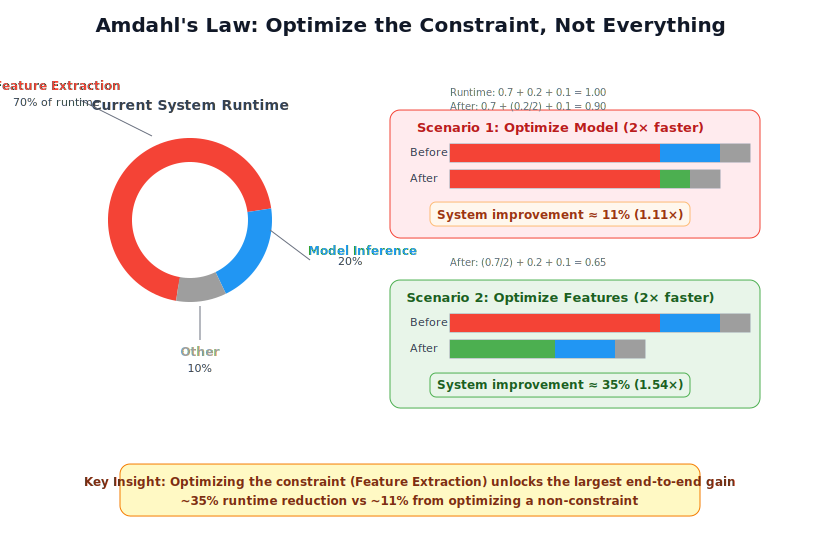

Barnard turns this into a strict chain of focused pairings. Each pairing links a WHAT (what you need) to a HOW (how to get it), maintaining a one-to-one relationship that keeps focus razor-sharp:

1. **Goal → Constraint**: WHAT do I want? More of the Goal. HOW? By getting more of the Constraint — the single resource I don't have enough of.
2. **Constraint → Problem**: WHAT limits the Constraint? The one Problem causing at least 50% of the gap.
3. **Problem → Conflict**: WHY hasn't the Problem been solved? Because it's an unresolved Conflict between two necessary-but-competing approaches.
4. **Conflict → Innovation**: HOW do I resolve it? With an Innovation that captures the Pros of *both* the current approach and the new idea. The aim is all the Pros — but some tradeoffs may remain. The key is they're deliberate and tolerable, not the paralyzing either/or you started with.
5. **Innovation → Experiment**: HOW do I know it works? With a Minimally Viable Experiment — before building anything.

The six how-to steps below translate these pairings into ML-systems language. Step 1 defines the Goal (SLOs). Step 2 finds the Constraint (bottleneck). Step 3 uncovers the Problem (root cause). Step 4 maps the Conflict (hidden tradeoff). Step 5 designs the Innovation. Step 6 runs the Experiment.

So why does this matter for ML specifically? Because ML pipelines are textbook flow systems: ingest → features → inference → action. They have measurable stages with capacity limits. And they accumulate complexity over time — teams add features, models, and infrastructure without ever removing anything. This makes them natural candidates for constraint-based thinking. But ML teams rarely think this way, because they're trained to optimize *models*, not *systems*.

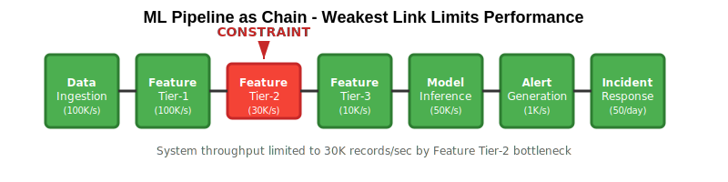

## Step 1: Define What Winning Looks Like

Before you can find the bottleneck, you need to define what success actually means — in numbers, not aspirations. "Detect anomalies," "reduce fraud," and "improve recommendations" aren't goals. They're wishes. Without measurable targets, every team member optimizes for a different thing, and you can't tell whether you're constrained by latency, precision, coverage, or something else entirely.

The fix is Service Level Objectives — specific, measurable thresholds tied to business outcomes:

| SLO Dimension | What It Measures | Fill In |
|--------------|------------------|---------|
| **Time-to-Decision (TTD)** | How fast the system produces an actionable output | p95 ≤ ___ |
| **Decision Budget** | How many outputs a human can realistically handle | ≤ ___ per day |
| **Outcome-Weighted Performance** | Accuracy weighted by business impact, not volume | ≥ ___% |
| **Coverage** | Fraction of relevant events actually processed | ≥ ___% |
| **Data Loss** | Events dropped or degraded in transit | ≤ ___% |

These five dimensions force hard conversations. A model with 99% accuracy but 30-minute detection latency fails the TTD target. A model with perfect precision but 500 daily alerts fails the decision budget. The SLOs define the feasible region — and crucially, reveal *what's blocking you* from reaching it.

Here's how our network anomaly detection system instantiated these:

- **TTD**: p95 ≤ 5 minutes from event to alert
- **Alert Budget**: ≤ 10 analyst-actionable alerts/day
- **Incident-Weighted Recall**: ≥ 90%

The same template applies to other domains. A fraud detection team might set TTD ≤ 200ms with ≤ 50 manual reviews/day. A recommendation system might target TTD ≤ 100ms with CTR-weighted precision ≥ X%.

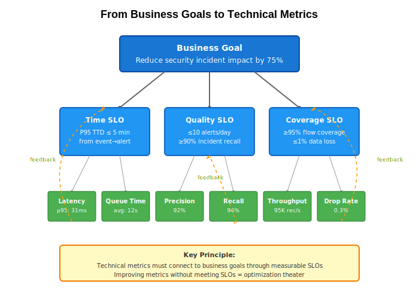

When defining SLOs, involve the people who *use* the system's outputs — not just the team that builds it. Security analysts, operations teams, business stakeholders. When they disagree (and they will — security wants recall, ops wants fewer alerts), the SLOs make the tradeoff explicit rather than hiding it inside model thresholds.

::: {.callout-warning}
## Pitfall: Vanity Metrics Over Business Outcomes
Teams optimize metrics that sound impressive but don't connect to business value. "99.9% precision" means nothing if you're missing 90% of incidents. "Processing 1M events/second" is irrelevant if decisions take 30 minutes. In our case, we celebrated achieving 99% detection rate on port scans — which the SOC ignored anyway — while missing lateral movement using legitimate credentials. Define SLOs tied to outcomes, not to model scorecards.
:::

**Key takeaway:** SLOs don't just measure success — they *reveal* what's blocking it. If you can't meet your TTD target, the bottleneck is somewhere in your latency path. If you can't meet your alert budget, the bottleneck is in precision or triage capacity.

## Step 2: Find Your Bottleneck

::: {.callout-tip}
## Mental Model
Your ML pipeline is a series of stages, each with a capacity ceiling. The stage with the lowest effective capacity is your constraint — it sets the ceiling for the entire system. Everything upstream queues up; everything downstream sits idle. Barnard's memorable shortcut: *"Check what you're waiting for. Where's the backlog?"*
:::

With SLOs defined, you can systematically measure where the system breaks down. Build a **constraint ledger** — a table measuring capacity, utilization, latency, queue depth, and top failure mode at each pipeline stage:

| Stage | Capacity (rec/s) | Utilization | p95 Latency | Queue Depth | Top Failure Mode |
|-------|------------------:|------------:|------------:|------------:|------------------|
| Ingest | 100K | 60% | 2ms | 0 | burst loss |
| Feature-Tier1 | 100K | 65% | 5ms | 0 | cache miss |
| **Feature-Tier2** | **30K** | **95%** | **50ms** | **1.2K** | **window skew** |
| Feature-Tier3 | 10K | 20% | 200ms | 0 | cold start |
| Inference | 50K | 40% | 10ms | 0 | batch sizing |
| Alerting | 1K | 10% | 100ms | 0 | dedup thrash |

The diagnostic pattern is simple: **high utilization + growing queue = bottleneck**. Feature-Tier2 jumps out — 95% utilization with a queue of 1.2K while other stages sit at 10–65%. During peak periods, the system is forced to either sample traffic (missing attacks), queue records (violating TTD), or drop features (hurting accuracy). The model never sees complete feature representations because feature extraction can't keep pace.

Build this table for your own system. The constraint is almost always obvious once you measure.

> **Capacity conversion**: 10 Gbps network traffic ≈ 100K flows/sec. 1M daily e-commerce orders ≈ 12/sec average, 50/sec peak. 10K IoT sensors at 1Hz ≈ 10K records/sec.

### Validate Before You Invest

Before building anything, run a 24-hour experiment: temporarily throw 3x resources at your suspected bottleneck. If system-level metrics improve dramatically, you've found the right constraint. If not, look elsewhere. This experiment costs a day; building the wrong solution costs months.

We provisioned 3x compute for Feature-Tier2, enabling 90K records/sec. The results were dramatic: detection time dropped, false positives decreased (the model makes better decisions with complete feature sets), and we nearly met our SLOs. No other improvement — not model accuracy, not infrastructure, not threshold tuning — would have achieved this.

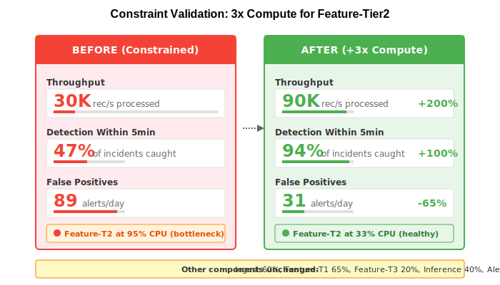

::: {.callout-warning}
## Pitfall: Premature Model Optimization
Teams spend months improving model accuracy while system-level metrics stagnate. The pipeline logic explains why: if the constraint isn't in the model, then making the model infinitely better has zero impact on system throughput. We spent three months experimenting with transformer architectures for 2% accuracy improvement — while 70% of traffic was never analyzed due to feature extraction bottlenecks. The transformer detected sophisticated attacks brilliantly, on the 30% of traffic it actually saw. Always validate the constraint before optimizing.
:::

**Key takeaway:** The constraint is the only thing worth optimizing right now. Everything else is rearranging deck chairs.

## Step 3: Understand Why It's Stuck

You've found the bottleneck. Now resist the urge to fix the surface symptom. "Feature extraction is slow" is a temperature reading, not a diagnosis. You need the underlying cause — because the cause determines the cure.

### Five Whys — With Evidence

The Five Whys technique is simple: ask "why" repeatedly until you reach a root cause, but *validate each answer with evidence* before proceeding to the next. Unvalidated whys lead to plausible-sounding but wrong root causes.

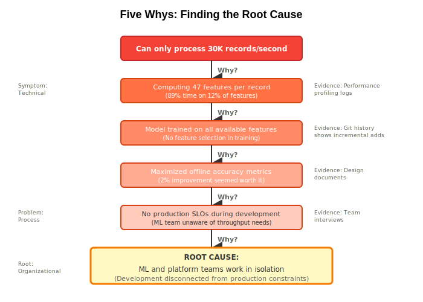

Here's how this played out for our Feature-Tier2 bottleneck:

1. **Why** is Feature-Tier2 at 95% utilization? → It computes 47 features per record. *(Validated: profiling shows 89% of computation in 12% of features)*
2. **Why** so many features? → Designed for offline research with unlimited compute. *(Validated: 31 features contribute <0.1% to decisions)*
3. **Why** no production constraints in the design? → Development was disconnected from deployment. *(Validated: git history shows features added without removal)*
4. **Why** disconnected? → ML team and platform team operate in silos. *(Validated: team interviews confirm no shared requirements)*
5. **Why** silos? → No ownership of end-to-end system performance.

Notice where we ended up: the root cause isn't technical — it's organizational.

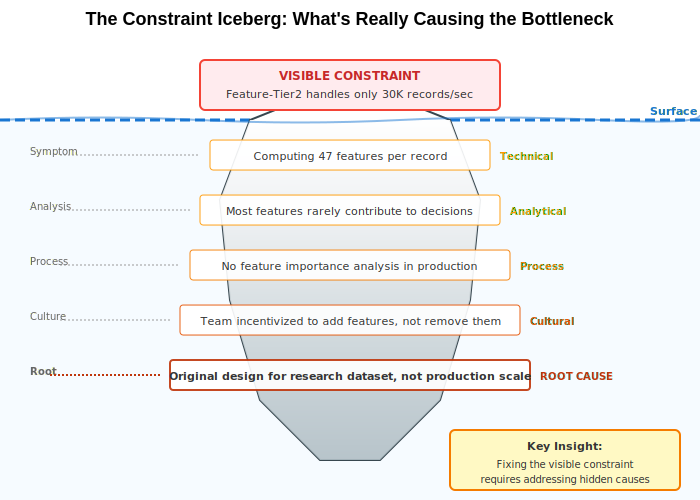

::: {.callout-note}
## Common Root Causes in ML Systems — Check Which Applies
- **Feature Explosion**: Teams extract every conceivable signal because "it might help." Features grow monotonically — each has an advocate, none has a removal date. Most provide redundant information.
- **Multi-granularity Overhead**: Computing signals at every timescale (seconds, minutes, hours, days) when most decisions only need one. Common in anomaly detection, fraud, and demand forecasting.
- **Stale Reference Data**: Maintaining expensive rolling statistics (baselines, embeddings, aggregates) for thousands of entities, even though most change negligibly between updates. The recomputation cost dwarfs the information gained.
:::

If your Five Whys keep ending at technical causes, go one more level. The technical problem often has an organizational parent — siloed teams, misaligned incentives, no end-to-end ownership. These patterns aren't unique to our system. Fraud detection, recommendations, and forecasting all exhibit the same failure modes.

::: {.callout-warning}
## Pitfall: Feature Creep Without Cost Analysis
Feature counts grow monotonically because each has an advocate who remembers when it caught something. Our system grew from 50 to 247 features over two years. Analysis showed 180 contributed <0.1% to decisions but consumed 60% of computation. Track a **feature value score** — importance divided by computational cost — and require cost-benefit analysis for new features.
:::

**Key takeaway:** Root causes are usually organizational, not algorithmic. If you fix the technical symptom without fixing the organizational cause, the symptom will return.

## Step 4: See the Hidden Tradeoff

You know the root cause. So why hasn't anyone fixed it? Almost always, it's because the problem is an unresolved conflict — and people are stuck choosing between two approaches that both seem necessary.

Barnard puts it precisely: *any problem can be defined as an unresolved conflict.* In our case, the Feature-Tier2 bottleneck persists because of a fundamental tension:

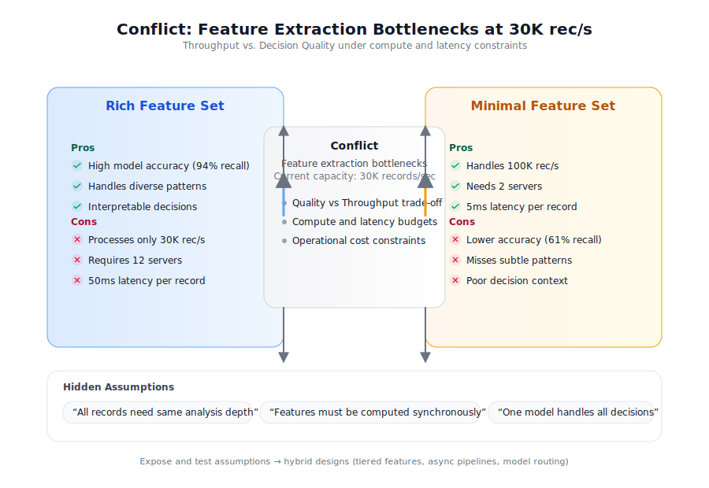

We need **rich feature analysis** for accurate detection of sophisticated attacks. We *also* need **efficient processing** for real-time response and cost control. These seem to contradict each other, so the team oscillates — add features after a missed attack, remove features after a performance degradation. Two years later, they're exactly where they started.

### Why Teams Get Stuck

Barnard identifies two failure modes that keep teams trapped in these oscillations:

- **Getting stuck / procrastinating**: Exaggerated fears — fear of losing what the current approach does well, or fear of the effort and risk required to change. ("If we remove features, we'll miss attacks.")
- **Overreacting / jumping to conclusions**: Exaggerated frustration with the current approach's downsides, or exaggerated expectations of a new solution. ("Let's just throw out all the expensive features and rely on the model.")

Most ML teams alternate between these two modes without recognizing the pattern.

::: {.callout-warning}
## Pitfall: Alert Budget Myopia
A textbook case of oscillation: facing missed incidents, teams lower thresholds (overreacting). This floods analysts with alerts, who start ignoring them, leading to *more* missed incidents — which triggers another round of threshold lowering. Little's Law makes the math concrete: L = λW — if analysts can investigate 50 alerts/day and each takes 45 minutes, that's the hard capacity ceiling. No threshold change can overcome it. This is the precision/coverage conflict manifesting as a vicious cycle.
:::

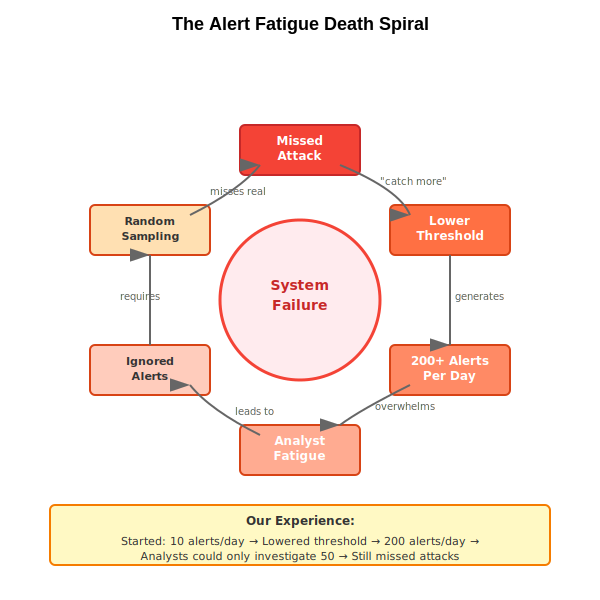

### Map Your Conflict

The breakthrough comes from asking: *what assumptions make this conflict seem unresolvable?* To find them, map the conflict explicitly:

```md
We need [rich feature analysis] to achieve [accurate detection].
We need [efficient processing] to achieve [real-time response].
These conflict because we assume:
  1. All records need the same analysis depth
  2. Features must be computed synchronously
  3. One model handles all decisions

Challenge each:
  - Is assumption 1 always true? No — routine DNS queries
    don't need the same scrutiny as connections to unknown IPs.
  - Is assumption 2 always true? No — historical comparisons
    could be asynchronous.
  - Is assumption 3 always true? No — different attack types
    could use specialized models.
```

This template works for any ML conflict. A fraud detection team might write: "We need comprehensive transaction analysis AND sub-200ms decisions. Hidden assumption: every transaction needs the same analysis depth." A recommendation team: "We need deep personalization AND instant page load. Hidden assumption: personalization must happen at request time."

::: {.callout-note}
## Common ML Conflicts
- **Accuracy vs Latency**: Complex models are more accurate but slower
- **Precision vs Coverage**: Tight thresholds reduce false positives but miss edge cases
- **Real-time vs Historical Context**: Immediate response vs rich contextual analysis
- **Generic vs Specific Models**: Broad coverage vs environment-specific accuracy
:::

**Key takeaway:** The tradeoff that's blocking you is almost never fundamental. It persists because of hidden assumptions. Find the assumption. Challenge it. The conflict evaporates.

## Step 5: Break the Tradeoff

You've identified the assumptions propping up the conflict. Now comes the payoff: designing a solution that captures the Pros of both the current approach and the alternative.

The goal is to get as many Pros from both sides as possible. Sometimes you genuinely get all of them. More often, some tradeoffs remain — added complexity, operational overhead, calibration effort. The difference from compromise is that these residual cons are *deliberate and manageable*, not the paralyzing either/or that kept the team stuck. You're not splitting the difference. You're changing the game so the remaining tradeoffs feel trivial compared to where you started.

### The Thinking Process

After mapping your conflict and challenging assumptions (Step 4), work through each challenged assumption systematically:

1. **Sketch the system without the assumption.** If you challenged "all records need the same analysis depth," draw the pipeline where they don't. What would variable-depth processing look like? What decides the depth?

2. **Look for the four reusable patterns.** Most ML system innovations are combinations of these:

    - **Cascade filtering** — cheap check first, expensive check only when needed. Applicable whenever most inputs are routine. (Fraud: score transactions with simple rules before running the full model. Recs: serve cached recommendations before running personalization.)
    - **Async enrichment** — decide now, enrich later. Useful whenever decision speed and decision quality have different time horizons. (Generate an alert with basic info immediately; add forensic context over the next 30 seconds.)
    - **Confidence-based routing** — let the model decide how much compute each input deserves. Turns a fixed-cost pipeline into an adaptive one. (High-confidence benign traffic exits at Tier-1; uncertain traffic escalates.)
    - **Feature caching** — never compute the same thing twice across pipeline stages. Obvious but rarely implemented. (Features from early triage stages are reused in deep analysis — we achieved 84% cache hit rates.)

3. **Check for async opportunities** — what's being computed *before* the decision that could move to *after*?

4. **Check for caching opportunities** — what's being computed repeatedly across stages, records, or time windows?

### A Worked Example: Progressive Analysis

In our case, the most load-bearing assumption was: *"All records need the same analysis depth."* Once you challenge it, the architecture follows from the patterns above — cascade filtering with confidence-based routing between tiers:

| Tier | Features | Model | Traffic Seen | Latency |
|------|----------|-------|-------------|---------|
| **Tier-1**: Wire-speed Triage | 5 cheap features | Logistic regression | 100% (68% exits) | ~3ms |
| **Tier-2**: Fast Analysis | 25 features | Moderate | ~32% | ~15ms |
| **Tier-3**: Deep Analysis | 100 features | Complex | ~4% | ~100ms |
| **Forensic**: Full Analysis | All features | Exhaustive | <1% | ~500ms |

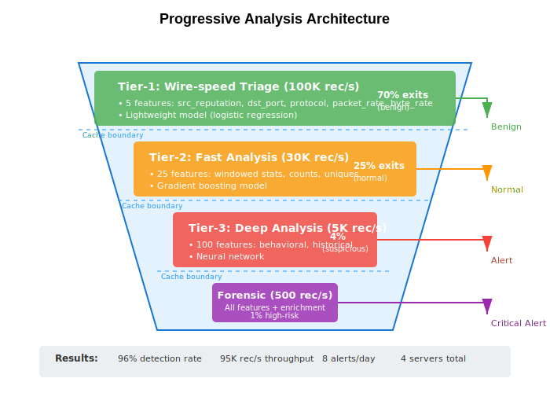

Each stage outputs a prediction *and* a confidence score. High-confidence benign traffic exits immediately. Low confidence escalates. When stages experience backlog, confidence thresholds adjust dynamically — low-risk records defer to async processing during congestion, ensuring high-risk traffic always gets full analysis. And alerts are generated immediately with basic info, then progressively enriched over 30 seconds with connection context, historical patterns, and full forensics.

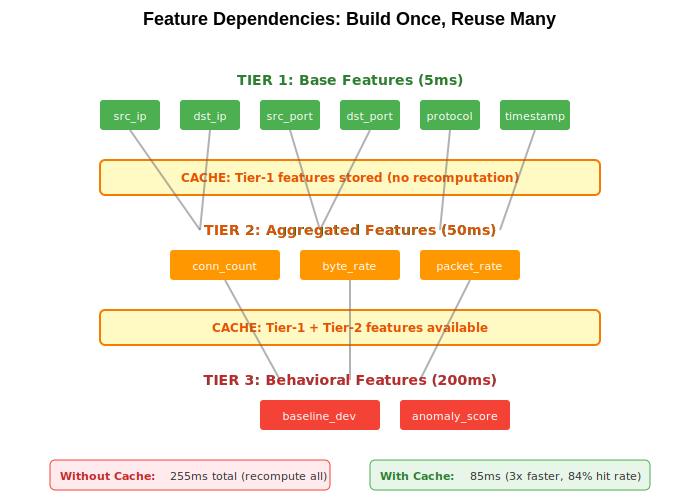

### Fix the Organization Too

Remember: Step 3 told us the root cause was organizational — siloed teams, no end-to-end ownership, features added without production constraints. The progressive architecture only sticks if the organizational structure changes with it. We restructured so ML and platform teams share SLOs, and adding features now requires cross-team cost-benefit approval. Without this, the feature explosion that caused the original bottleneck would have returned within a year.

**Key takeaway:** The innovation doesn't have to be novel to the field. It has to be novel to *your* system. Progressive analysis is a known pattern — applying it to our specific bottleneck was the breakthrough. But the technical fix and the organizational fix are a package deal.

## Step 6: Prove It Works

You've designed a solution on paper. Before you spend three months building it, spend two weeks proving the riskiest assumption.

An important distinction: a Minimally Viable Experiment (MVE) comes *before* a Minimally Viable Product (MVP). An MVP builds the smallest usable product. An MVE is smaller — it tests whether the core assumption behind the innovation is even valid. Don't build anything until you've validated the assumption.

### Identify the Riskiest Assumption

Ask: *what's the single assumption that, if wrong, kills the entire approach?* For our progressive architecture, it was: "Can Tier-1 triage accurately identify benign traffic without missing attacks?" If lightweight features can't reliably separate benign from suspicious, the whole cascade fails.

Design the smallest test that answers this question. We trained a logistic regression on 5 cheap features and tested on realistic data with known attacks:

```python
tier1_features = [
    'src_reputation_score',  # Pre-computed reputation
    'dst_port',              # Destination port number
    'protocol',              # TCP/UDP/ICMP
    'packet_rate',           # Packets per second
    'byte_rate'              # Bytes per second
]

tier1_model = LogisticRegression(C=1.0)
tier1_model.fit(X_train[tier1_features], y_train_benign)
```

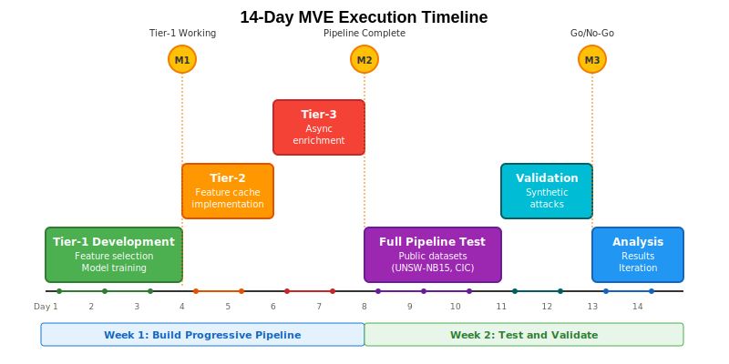

### Results

| Metric | Result |
|--------|--------|
| Triage rate | 68% identified as benign at Tier-1 |
| False negative rate | 0% — no attacks missed |
| Throughput | 95K records/sec |
| p95 latency | 3ms per record |
| Cache hit rate | 84% across stages |

### What the Iterations Taught Us

The MVE revealed things we couldn't have predicted from design alone:

1. **Confidence calibration**: Initial triage was too conservative — 32% of traffic passed to Tier-2 unnecessarily. The model lacked confidence on legitimate-but-unusual ports. Retraining with expanded examples achieved a 71% triage rate without missing attacks.

2. **Dynamic resource allocation**: Fixed compute allocation caused bottlenecks when traffic patterns shifted. We implemented stages borrowing compute from idle stages, smoothing throughput across load profiles.

3. **Feature pruning**: 15 Tier-3 features never influenced decisions in production. Removing them increased throughput 30% without affecting detection. Track a feature value score — importance / computational_cost — and prune ruthlessly.

### Production Rollout Checklist

- **Shadow mode**: Run progressive pipeline parallel to existing system. Compare decisions, measure divergence. Success: no P1 incidents missed for one week.
- **Canary (10%)**: Route 10% of traffic through progressive pipeline. A/B test alert quality with analysts. Success: SLOs maintained, analyst preference ≥ baseline.
- **Gradual expansion**: 10% → 25% → 50% → 75%, holding each level for 48 hours. Automated rollback on any SLO violation.
- **Full production**: 100% with old system as instant fallback. Document runbooks, train operations team. Success: one week at 100% with all SLOs met.

### Go/No-Go Criteria

After the MVE, the decision is straightforward: does the riskiest assumption hold? If yes — the cascade correctly separates benign from suspicious — proceed to shadow mode. If the assumption fails, you haven't wasted months; you've spent two weeks learning that you need a different innovation. Go back to Step 5 and challenge a different assumption.

**Key takeaway:** A two-week MVE teaches more than two years of production experience. Test your riskiest assumption first.

## The Cycle Continues

Here's the part that surprises people: solving one constraint doesn't fix the system forever. It reveals the *next* constraint. And that's a feature, not a bug — because you always know exactly what to work on.

With Feature-Tier2 no longer the bottleneck, a new one emerged in our system: alert investigation. SOC analysts averaged 45 minutes per Tier-3 alert. This limited how many sophisticated attacks could be properly investigated. Applying the framework again:

- **Goal → Constraint**: Reduce investigation time to 15 minutes while maintaining decision quality
- **Constraint → Problem**: Analysts manually correlate across multiple tools and data sources
- **Problem → Conflict**: Automated enrichment vs human judgment
- **Conflict → Innovation**: AI-assisted investigation that augments rather than replaces analysts
- **Innovation → Experiment**: Test on historical alerts with analyst feedback

Each cycle makes the system more capable. Here's where our NTA system ended up after one full pass through the framework:

| Metric | Before | After | Change |
|--------|--------|-------|--------|
| Detection time (p95) | 47 min | 3.2 min | 15x faster |
| Daily analyst alerts | 847 | 11 | 98.7% reduction |
| Incidents missed/month | 23 | 0 | Eliminated |
| Traffic coverage | 30% | 98% | Full visibility |
| Feature-Tier2 utilization | 95% | 42% | Headroom restored |

The constraint moved — from feature extraction to investigation to response automation — and each move represents the next opportunity for breakthrough improvement.

```{mermaid}
%%| fig-cap: "The Theory of Constraints is a cycle, not a line"
flowchart LR
    A["<b>Define Goal</b><br/>Set SLOs"] --> B["<b>Find Constraint</b><br/>Build ledger"]
    B --> C["<b>Understand Why</b><br/>Root cause"]
    C --> D["<b>Map Conflict</b><br/>Challenge assumptions"]
    D --> E["<b>Innovate</b><br/>Best of both sides"]
    E --> F["<b>Experiment</b><br/>MVE → rollout"]
    F --> |"Constraint moves"| A

    style A fill:#e8f5e9,stroke:#333
    style B fill:#e3f2fd,stroke:#333
    style C fill:#fff3e0,stroke:#333
    style D fill:#fce4ec,stroke:#333
    style E fill:#f3e5f5,stroke:#333
    style F fill:#e0f7fa,stroke:#333
```

The Theory of Constraints isn't another optimization technique. It's an operating system for continuous improvement. The constraint keeps moving, but so do you.

## Conclusion

Most ML teams are stuck in optimization theater — tuning components that don't govern system performance. The Theory of Constraints gives you a way out: find the one bottleneck that sets the ceiling, understand why it's stuck, and design an innovation that breaks the tradeoff instead of compromising on it.

The method is six steps, but the discipline is one idea: *at any moment, only one thing limits your system.* Find it. Fix it. Then find the next one.

If you take one thing from this post, make it this: before your next "optimization" sprint, build the constraint ledger. Measure every stage. Find the row with high utilization and a growing queue. That's where your effort belongs — and nowhere else.

## References

- Goldratt, E. M. (1984). "The Goal: A Process of Ongoing Improvement." North River Press.
- Sculley, D., et al. (2015). "Hidden Technical Debt in Machine Learning Systems." NIPS 2015.
- Paleyes, A., et al. (2022). "Challenges in Deploying Machine Learning: A Survey of Case Studies." ACM Computing Surveys.
- Kleppmann, M. (2017). "Designing Data-Intensive Applications." O'Reilly Media.
- Polyzotis, N., et al. (2018). "Data Lifecycle Challenges in Production Machine Learning." SIGMOD Record.
- Chandola, V., et al. (2009). "Anomaly Detection: A Survey." ACM Computing Surveys.
- Ahmed, M., et al. (2016). "A Survey of Network Anomaly Detection Techniques." Journal of Network and Computer Applications.
- Sommer, R., & Paxson, V. (2010). "Outside the Closed World: On Using Machine Learning for Network Intrusion Detection." IEEE S&P.
