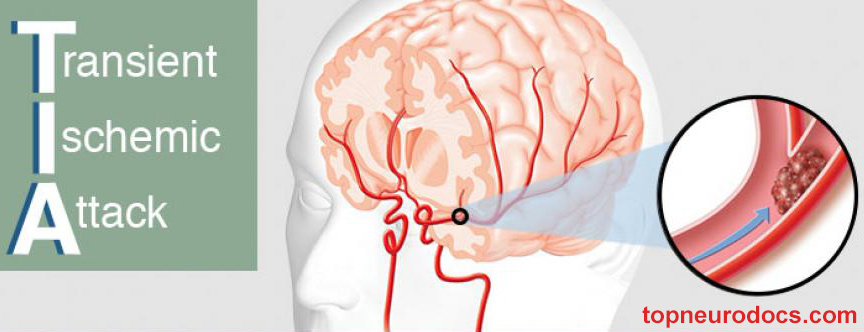

A transient ischemic attack (TIA) is like a stroke, producing similar symptoms, but usually lasting only a few minutes and causing no permanent damage. Often called a ministroke, a transient ischemic attack may be a warning.

About 1 in 3 people who have a transient ischemic attack will eventually have a stroke, with about half occurring within a year after the transient ischemic attack.

The goal of this project is to build a binary classifier to predict Transient Ischemic Attack (TIA) and then deploy the best model as a RESTful API.

Check out the project on [github](https://github.com/ImadDabbura/transient-ischemic-attack).
