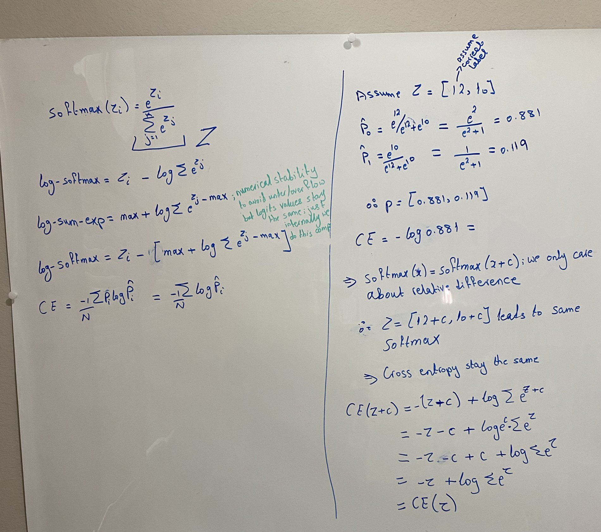

Adding the same constant to every logit changes nothing. In softmax the $e^{c}$
factors out of the numerator and the denominator, and in $L(z) = -z_y +
\log\sum_j e^{z_j}$ the $c$ from the true-class term cancels the $c$ that comes
out of the sum.

With $z = [12, 10]$, dividing through by $e^{10}$ leaves $\hat p_0 =
e^{2}/(e^{2}+1) = 0.881$, so $[1012, 1010]$ and $[2, 0]$ give the same
probabilities and the same loss, $0.127$. Only the gap of $2$ was ever used.

Also for gradient too: $\partial L / \partial z = p - y$ sees the logits only through $p$.

